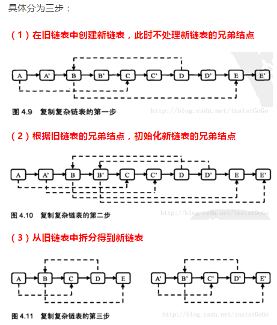

# [剑指offer牛客网顺序汇总](https://www.nowcoder.com/ta/coding-interviews)

> **==以下序号为牛客网题目序号，面试题序号为书本题目序号==**

## 1.面试题4：[二维数组中的查找](http://www.nowcoder.com/practice/abc3fe2ce8e146608e868a70efebf62e?tpId=13&tqId=11154&rp=1&ru=/ta/coding-interviews&qru=/ta/coding-interviews/question-ranking)

> **题目：**在一个二维数组中（每个一维数组的长度相同），**==每一行都按照从左到右递增的顺序排序，每一列都按照从上到下递增的顺序排序==**。请完成一个函数，输入这样的一个二维数组和一个整数，判断数组中是否含有该整数。


```c++
bool Find(int target, vector<vector<int> > array) 
{
    int rows=array.size();//总行数
    int cols=array[0].size();//第一行（任取一行）的个数，即总列数
    int i=0,j=cols-1;//第0行的最后1列，即从右上角开始，如下图解
    while(j>=0 && i<rows)//循环跳出条件
    {
        if(array[i][j]==target)
            return true;//等于目标值，返回true，跳出循环。
        else if(array[i][j]>target)
            j--;//大于目标值，在其左边区域寻找。
        else
            i++;//小于目标值，在其下边区域寻找。
    }
    return false;//超过边界，仍未找到，返回false。
}
```


## 2.面试题5：[替换空格](http://www.nowcoder.com/practice/4060ac7e3e404ad1a894ef3e17650423?tpId=13&tqId=11155&rp=1&ru=/ta/coding-interviews&qru=/ta/coding-interviews/question-ranking)

> **题目：**请实现一个函数，将一个字符串中的每个空格替换成`“%20”`。例如，当字符串为`We Are Happy.`则经过替换之后的字符串为`We%20Are%20Happy`。

```c++
void replaceSpace(char *str,int length)//输入为字符串首字符的指针，和允许使用字符的总长度。
{
    if(str==nullptr || length<=0)//首指针为空或者字符串长度<=0，直接返回空。
        return;
    int l = 0;//记录字符串长度的变量。
    int num_blank = 0;//记录字符串中空格数量的变量。
    int i=0;//循环字符串的下标。
    while(str[i] !='\0')//遍历字符串直到为休止符为止。
    {
        l++;//长度+1。
        if(str[i]==' ') 
            num_blank++;//遇到空格时，空格数量+1。
        i++;//下标+1。
    }//每一个空格替换后，会多用2个长度。
    int new_l = l + num_blank*2;//新的字符串长度为旧的长度+2倍空格数量
    if (l > length || num_blank==0)//当新的长度超过允许的长度，或者空格为0，退出
        return;
    while(l >=0)
    {
        if(str[l]==' ')
        {
            str[new_l--] = '0';
            str[new_l--] = '2';
            str[new_l--] = '%';
            l--;
        }
        else
            str[new_l--] = str[l--];
    }
}
```


## 3.面试题6：[从尾到头打印链表](http://www.nowcoder.com/practice/d0267f7f55b3412ba93bd35cfa8e8035?tpId=13&tqId=11156&rp=1&ru=/ta/coding-interviews&qru=/ta/coding-interviews/question-ranking)

> **题目：**输入一个链表，按链表值==**从尾到头**==的顺序返回一个`ArrayList`。

```c++
//struct ListNode
//{
//    int val;
//    struct ListNode *next;
//    ListNode(int x) : val(x), next(NULL) {}
//};
vector<int> printListFromTailToHead(ListNode* head) 
{
    vector<int> res;
    while(head)
    {
        res.insert(res.begin(),head->val);
        head = head->next;
    }
    return res;
}
```

## 4.面试题7：[重建二叉树](http://www.nowcoder.com/practice/8a19cbe657394eeaac2f6ea9b0f6fcf6?tpId=13&tqId=11157&rp=1&ru=/ta/coding-interviews&qru=/ta/coding-interviews/question-ranking)

> **题目：** 输入某二叉树的前序遍历和中序遍历的结果，请重建出该二叉树。假设输入的前序遍历和中序遍历的结果中==**都不含重复的数字**==。例如输入前序遍历序列{1,2,4,7,3,5,6,8}和中序遍历序列{4,7,2,1,5,3,8,6}，则重建二叉树并返回。


```c++
/**
 * Definition for binary tree
 * struct TreeNode {
 *     int val;
 *     TreeNode *left;
 *     TreeNode *right;
 *     TreeNode(int x) : val(x), left(NULL), right(NULL) {}
 * };
 */
TreeNode* reConstructBinaryTree(vector<int> pre,vector<int> vin)
{
    if(pre.size()!=vin.size())
        return nullptr;//长度都不一样，直接不做了。
    if(pre.size()==0||vin.size()==0)//如果递归到前序或者中序长度为0，返回空。
        return nullptr;//递归的最后一层到这里结束返回。
	int gen = 0;//声明变量用来找到 根节点在中序遍历中的位置。
	int i = 0;//循环下标。
	for( i =0;i<pre.size();i++)
	{
        if(vin[i]==pre[0])//当中序遍历的值等于前序第一个也就是根节点的值
            gen = i;//记录根节点在总序遍历中的下标
	}
	vector<int> pre_left,pre_right,vin_left,vin_right;
	for(i=0;i<gen;i++) 
        pre_left.push_back(pre[i+1]);//左子树的前序遍历 如图中的247
	for(i=gen+1;i<pre.size();i++) 
        pre_right.push_back(pre[i]);//右子树的前序遍历 如图中的3568
	for(i=0;i<gen;i++) 
        vin_left.push_back(vin[i]);//左子树的中序遍历 如图中的472
	for(i=gen+1;i<vin.size();i++) 
        vin_right.push_back(vin[i]);//右子树中序遍历 如图中的5386
	TreeNode* res = new TreeNode(pre[0]);//声明以根节点的二叉树
	res->left = reConstructBinaryTree(pre_left,vin_left);//以左子树的前序和中序重建左子树
	res->right= reConstructBinaryTree(pre_right,vin_right);//以右子树的前序和中序重建右子树
	return res;
}
//acwing 的递归dfs 思想一样，操作养成dfs的习惯
TreeNode* reConstructBinaryTree(vector<int> pre,vector<int> vin) 
{
    if(pre.size()==0||vin.size()==0||pre.size()!=vin.size())
        return nullptr;
    int n = pre.size();
    return dfs(pre,vin,0,n-1,0,n-1);
}
TreeNode* dfs(vector<int> pre,vector<int> in, int pl,int pr,int il,int ir)
{
    if(pl>pr)
        return nullptr;
    int k =0;
    for(int i = il;i<=ir;i++)
        if(in[i]==pre[pl])
        {
            k = i - il;
            break;
        }
    TreeNode* res = new TreeNode(pre[pl]);
    res->left = dfs(pre,in,pl+1,pl+k,il,il+k-1);
    res->right= dfs(pre,in,pl+k+1,pr,il+k+1,ir);
    return res;
}
```


> ==图中分别都是左子树的前序（247）和中序（472）遍历，右子树的前序（3568）和中序（5386）。==

## 5.1面试题9：[用两个栈实现队列](http://www.nowcoder.com/practice/54275ddae22f475981afa2244dd448c6?tpId=13&tqId=11158&rp=1&ru=/ta/coding-interviews&qru=/ta/coding-interviews/question-ranking)

> **题目：** 用两个栈来实现一个队列，完成队列的Push和Pop操作。 队列中的元素为int类型。

```c++
class Solution
{
public:
    void push(int node) 
    {
        while(stack1.size())
        {
            stack2.push(stack1.top());
            stack1.pop();
        }//把stack1中的全部放到stack2去暂时保存下，把后来的放到stack1的底部
        stack1.push(node);//stack1作为最终队列形态结果
        while(stack2.size())
        {
            stack1.push(stack2.top());
            stack2.pop();
        }//stack1底部填好了，再把stack2保存的还回来。
    }
    int pop() 
    {
        int res = stack1.top();
        stack1.pop();
        return res;//stack1已经是要求的队列形态了。
    }
private:
    stack<int> stack1;
    stack<int> stack2;
};
```

### 5.2面试题9相关题目：[用两个队列实现栈](https://leetcode-cn.com/problems/implement-stack-using-queues/description/)

>**题目：**使用队列实现栈的下列操作：
>
>- push(x) -- 元素 x 入栈
>- pop() -- 移除栈顶元素
>- top() -- 获取栈顶元素
>- empty() -- 返回栈是否为空
>
>**注意:**
>
>- 你只能使用队列的基本操作-- 也就是 `push to back`, `peek/pop from front`, `size`, 和 `is empty` 这些操作是合法的。
>- 你所使用的语言也许不支持队列。 你可以使用 list 或者 deque（双端队列）来模拟一个队列 , 只要是标准的队列操作即可。
>- 你可以假设所有操作都是有效的（例如, 对一个空的栈不会调用 pop 或者 top 操作）。

```c++
class MyStack 
{//这是leetcode的题目所以模板和剑指offer不一样
public:
    /** Initialize your data structure here. */
    queue<int> q1;
    queue<int> q2;
    MyStack() {}
    /** Push element x onto stack. */
    void push(int x) 
    {
        while(q1.size())
        {
            q2.push(q1.front());
            q1.pop();
        }//q1的全部放到q2去暂时保存下。
        q1.push(x);//q1作为最后的栈要求形态结果。画图理解。放到q1的顶部
        while(q2.size())//再把q2暂时保管的还回来。
        {
            q1.push(q2.front());
            q2.pop();
        }
    }   
    /** Removes the element on top of the stack and returns that element. */
    int pop() 
    {
        int res = q1.front();
        q1.pop();
        return res;//q1已经是完美的栈形态了。下同，直接用q1就行。
    }  
    /** Get the top element. */
    int top() 
    {
        return q1.front();
    }
    /** Returns whether the stack is empty. */
    bool empty() 
    {
        return q1.empty();
    }
};
```


## 6.面试题11：[旋转数组的最小数字](http://www.nowcoder.com/practice/9f3231a991af4f55b95579b44b7a01ba?tpId=13&tqId=11159&rp=1&ru=/ta/coding-interviews&qru=/ta/coding-interviews/question-ranking)

> **题目:** 把一个数组最开始的若干个元素搬到数组的末尾，我们称之为数组的旋转。 输入一个**==非减排序的数组==**的一个旋转，输出旋转数组的最小元素。 例如数组{3,4,5,1,2}为{1,2,3,4,5}的一个旋转，该数组的最小值为1。 NOTE：给出的所有元素都大于0，若数组大小为0，请返回0。


```c++
#include <iostream>
#include <vector>
using namespace std;
int minNumberInRotateArray(vector<int> rotateArray) 
{
	int l = rotateArray.size();
	if(l==0)
		return 0;//如果数组为空，返回0完事。
	int low = 0,high = l-1,mid=0;//初始化指针P1，P2.如图
	while(low < high)//循环直至两个指针都汇聚于low，也就是P1.
	{
		mid = (low+high)>>1;//二分法，取中间指针，>>1位运算等价于/2，如果3.5往前取3.
		if(rotateArray[mid]<rotateArray[high])//mid值小于high值
			high = mid;//mid到high非减，最小值在mid或mid左边，把mid当high，等于把mid右边砍掉
		else if(rotateArray[mid] == rotateArray[high])//mid值等于high值
			high--;//这种情况最小值在mid或mid左或mid右都有可能，high--，一个个试，不能low++
		else//mid值大于high值
			low = mid +1;//最小值必定在mid右边，把mid和mid左边都砍掉。
	}//这里只能有high值作为标准分类，以low值分类试过不行，可能因为是找的最小值。
	return rotateArray[low];//最后low和high相等在最小值。
}
int main()
{
	vector<int> a={1,2,1,1,1};//a，b两个特殊情况需要特别对待，牛客网检查不出错误
	vector<int> b={1,1,1,2,1};//和下图一个意思，只是牛客网说不带0
	vector<int> c={1,2,3,4,5};//这种情况牛客网也检查不出错误，bug挺多的
	vector<int> d={3,4,5,1,2};//这种方法，这五种情况都能做对。
	vector<int> e={4,5,1,2,3};//最开始写的方法abc都不包含，牛客网也通过了，就不贴了。
    cout <<minNumberInRotateArray(a) << endl;
	cout <<minNumberInRotateArray(b) << endl;
	cout <<minNumberInRotateArray(c) << endl;
	cout <<minNumberInRotateArray(d) << endl;
	cout <<minNumberInRotateArray(e) << endl;
    return 0;
}
//以下为错误答案，检测不出ab种某一情况，但是可以通过牛客的检测，截止2019年2月22号
int minNumberInRotateArray(vector<int> rotateArray)
{
    if(rotateArray.size()==0) return 0;
    int left = 0,right = rotateArray.size()-1,mid=0;
    while(rotateArray[left] >= rotateArray[right])
    {
        if(right-left==1)
        {
            mid=right;
            break;
        }
        mid = (left+right)/2;
        if(rotateArray[mid]>rotateArray[right]) 
            left=mid;
        else 
            right = mid;
    }
    return rotateArray[mid];
}//需要加上等于的判断，让right--。
```


## 7.面试题10 题目一：[斐波那契数列](http://www.nowcoder.com/practice/c6c7742f5ba7442aada113136ddea0c3?tpId=13&tqId=11160&rp=1&ru=/ta/coding-interviews&qru=/ta/coding-interviews/question-ranking)

> **题目：**大家都知道斐波那契数列，现在要求输入一个整数n，请你输出斐波那契数列的第n项（从0开始，第0项为0）。n<=39

```c++
//大神的解法 C++动态规划
int Fibonacci(int n)
{//这里数列为 0 1 1 2 3 5 8 .... 每两个1组
    int f = 0, g = 1;//这是第0组 0 1 ,第一组就是 1 1 ,第二组就 1 2 ,第三组是 2 3
    while(n--) //求第n组数的第一个数f,就往后平移n次
    {
        g += f;//循环内部做fg的平移一次
        f = g - f;
    }
    return f;//返回第n组数的第一个数
}
```

## 8.面试题10 题目二：[跳台阶](http://www.nowcoder.com/practice/8c82a5b80378478f9484d87d1c5f12a4?tpId=13&tqId=11161&rp=1&ru=/ta/coding-interviews&qru=/ta/coding-interviews/question-ranking)

> **题目：**一只青蛙一次可以跳上1级台阶，也可以跳上2级。求该青蛙跳上一个n级的台阶总共有多少种跳法（先后次序不同算不同的结果）。


```c++
int jumpFloor(int n) 
{//这里数列是1 2 3 5 8 13 
    int f=1,g=2;//第一组是1 2 ,第二组是 2 3 ,第三组是 3 5 
    n--;//求第n组数的第一个,因为数组是从下标1开始,只需要平移(n-1)次
    while(n--)//循环(n-1)次
    {
        g += f;//每次循环 把fg做一次往后平移
        f = g-f;
    }
    return f;//返回第n组数的第一个数f
}
```

## 9.面试题10 扩展题目：[变态跳台阶](http://www.nowcoder.com/practice/22243d016f6b47f2a6928b4313c85387?tpId=13&tqId=11162&rp=1&ru=/ta/coding-interviews&qru=/ta/coding-interviews/question-ranking)

> **题目：**一只青蛙一次可以跳上1级台阶，也可以跳上2级……它也可以跳上n级。求该青蛙跳上一个n级的台阶总共有多少种跳法。


> ==我们可以想象要跳到n级，==
>
> 1. ==如果要经过第n-1级，那最后都是从0跳到n-1级，再从n-1跳1下到第n级，那就是有f(n-1)种跳法。==
> 2. ==如果不经过第n-1级，那就是从0跳到第n级，总共可选的只有(n-1)个台阶，也是f(n-1)种跳法。==
> 3. ==综上所述，f(n) = f(n-1) + f(n-1) = 2 * f(n-1) = 2^2 * f(n-2) = 2^(n-1) * f(1) = 2^(n-1) .==
> 4. ==所以两个解法都行，但是第一种递归运算量更大。==

```c++
//方法1
int jumpFloorII(int n) 
{
    if(n==0) 
        return 0;
    if(n==1) 
        return 1;
    return 2*jumpFloorII(n-1);
}
//方法2
int jumpFloorII(int n) 
{
    if(n==0) 
        return 0;
    return pow(2,(n-1));
}
```

## 10.面试题10 相关题目：[矩形覆盖](http://www.nowcoder.com/practice/72a5a919508a4251859fb2cfb987a0e6?tpId=13&tqId=11163&rp=1&ru=/ta/coding-interviews&qru=/ta/coding-interviews/question-ranking)

> **题目：**我们可以用2*1的小矩形横着或者竖着去覆盖更大的矩形。请问用n个2*1的小矩形无重叠地覆盖一个2*n的大矩形，总共有多少种方法？


```c++
int rectCover(int n) 
{//这里数列是1 2 3 5 8 13 
    if(n==0)
        return 0;
    int f=1,g=2;//第一组是1 2 ,第二组是 2 3 ,第三组是 3 5 
    n--;//求第n组数的第一个,因为数组是从下标1开始,只需要平移(n-1)次
    while(n--)//循环(n-1)次
    {
        g += f;//每次循环 把fg做一次往后平移
        f = g-f;
    }
    return f;//返回第n组数的第一个数f
}
```

## 11.面试题15: [二进制中1的个数](http://www.nowcoder.com/practice/8ee967e43c2c4ec193b040ea7fbb10b8?tpId=13&tqId=11164&rp=1&ru=/ta/coding-interviews&qru=/ta/coding-interviews/question-ranking)

> **题目:** 输入一个整数，输出该数二进制表示中1的个数。其中负数用补码表示。

```c++
int NumberOf1(int n) 
{
    int count = 0;
    while (n)
    {
        ++count;
        n = (n-1)&n;//这一步把n的lowbit(最低位的1)变为0了
    }
    return count;
}
//方法二
int NumberOf1(int n) 
{
    int count = 0;
    while (n)
    {
        ++count;
        n = n - ((-n)&n);//(-n)&n是求n的lowbit的方法,n减去自身的lowbit就跟上面一样了.
    }//小白从www.acwing.com学到的,打个广告.lowbit是自身二进制最低位的1.
    return count;
}
```

## 12.面试题16: [数值的整数次方](http://www.nowcoder.com/practice/1a834e5e3e1a4b7ba251417554e07c00?tpId=13&tqId=11165&rp=1&ru=/ta/coding-interviews&qru=/ta/coding-interviews/question-ranking)

> **题目:** 给定一个double类型的浮点数base和int类型的整数exponent。求base的exponent次方。

```c++
double Power(double base, int e) 
{
    double res=1.0;
    int p = abs(e);//考虑指数为负数的情况
    while(p)
    {
        if(p&1==1)//把指数写成二进制,二进制分解为相加,变为底数相乘
            res *= base;
        p = p>>1;//右移一位
        base *= base;//该位置对应的底数
    }
    return (e>=0)?res:(1.0/res);//考虑直输为0的情况.
}
```

## 13.面试题21：[调整数组顺序使奇数位于偶数前面](http://www.nowcoder.com/practice/beb5aa231adc45b2a5dcc5b62c93f593?tpId=13&tqId=11166&rp=1&ru=/ta/coding-interviews&qru=/ta/coding-interviews/question-ranking)

> **题目:** 输入一个整数数组，实现一个函数来调整该数组中数字的顺序，使得所有的奇数位于数组的前半部分，所有的偶数位于数组的后半部分，并保证奇数和奇数，==偶数和偶数之间的相对位置不变==。

```c++
void reOrderArray(vector<int> &array) 
{
    int i,j;//定义两个指针,i指着数组最前面,j指着数组最后面
    for(i=0;i<array.size();i++)
        for(j=array.size()-1;j>i;j--)
        {
            if((array[j]&1)==1&&(array[j-1]&1)==0)//从后往前遇到奇偶对就交换
                swap(array[j],array[j-1]);//可以保持奇偶分别相对位置不变
        }
}
```

## 14.面试题22: [链表中倒数第k个结点](http://www.nowcoder.com/practice/529d3ae5a407492994ad2a246518148a?tpId=13&tqId=11167&rp=1&ru=/ta/coding-interviews&qru=/ta/coding-interviews/question-ranking)

> **题目:**  输入一个链表，输出该链表中倒数第k个结点。

> ==第一个指针先走k步,第二个指针开始走，当第一个指针走到尽头的时候，第二个指针就是倒数第K个结点==


> 这图是书上走先k-1步的方法,意思一样只是代码不太简洁,==走k步更好==

```c++
ListNode* FindKthToTail(ListNode* p, unsigned int k)
{
    auto p1=p;
    for(int i=0;i<k;++i)
    {
        if(p1)
            p1=p1->next;//第一个指针先走k步
        else 
            return nullptr;//总共都没有k个节点，不符合题意。
    }
    auto p2=p;
    while( p1)//两个指针一起走,当p1走到头,停止时,p在还有k步没走,也就是停在倒数第k个节点.
    {
        p1=p1->next;
        p2=p2->next;
    }
    return p2;
}
```

## 15.面试题24: [反转链表](http://www.nowcoder.com/practice/75e878df47f24fdc9dc3e400ec6058ca?tpId=13&tqId=11168&rp=1&ru=/ta/coding-interviews&qru=/ta/coding-interviews/question-ranking)

> **题目:** 输入一个链表，反转链表后，输出新链表的表头。

```c++
//方法一 递归
ListNode* Recur(ListNode* pre,ListNode* cur)
{//递归函数输入为当前所在节点的前一个位置 和 当前所在节点
    if(!cur) //这个是防止题目输入空链表
        return nullptr;
    else if(!cur->next)//这个是递归的终止条件
    {
        cur->next=pre;//最后一个节点穿上之前的已经反向的链表
        return cur;//完成反转
    }
    ListNode* next= cur->next;//当前节点往后走一步,取出这时单独的cur
    cur->next = pre;//单独的cur穿上之前的pre
    ListNode* p_new = Recur(cur,next);//每次递归都从第二个参数链表取第一个点穿上pre,作为pre,
    return p_new;
}
ListNode* ReverseList(ListNode* pHead)
{
    return Recur(nullptr,pHead);//递归函数需要两个输入
}
//举例子 反转1->2->3 递归函数
//第一次函数输入为(nullptr,1->2->3)
//第二次函数输入为(1->nullptr,2->3)
//第三次函数输入为(2->1->nullptr,3->nullptr)
//这里进入else if ,返回3->2->1->nullptr ,也就是3->2->1.完成

//方法二 循环  和递归的思想一样的
ListNode* ReverseList(ListNode* p) 
{//p为1->2->3
    ListNode* pre=nullptr;//pre为nullptr
    while(p!=nullptr)
    {
        auto next=p->next;//next为2->3
        p->next=pre;//p为1->nullptr
        pre=p;//pre为1->nullptr
        p=next;//p为2->3
    }
    return pre;
}
```

## 16.面试题25: [合并两个排序的链表](http://www.nowcoder.com/practice/d8b6b4358f774294a89de2a6ac4d9337?tpId=13&tqId=11169&rp=1&ru=/ta/coding-interviews&qru=/ta/coding-interviews/question-ranking)

> **题目:** 输入两个单调递增的链表，输出两个链表合成后的链表，当然我们需要合成后的链表满足单调不减规则。


```C++
ListNode* Merge(ListNode* pHead1, ListNode* pHead2)
{//理解递归学会抓递归函数的操作使得函数输入的变化 和 终止条件
    if(!pHead1)
        return pHead2;
    else if(!pHead2)
        return pHead1;//两个if都有可能是递归终止条件
    ListNode* res=nullptr;
    if(pHead1->val<pHead2->val)
    {//如下图
        res=pHead1;//这一行容易忘了,把1->提出来先
        res->next=Merge(pHead1->next,pHead2);//2->一坨作为结果连在1->后面.
    }
    else
    {
        res=pHead2;
        res->next=Merge(pHead1,pHead2->next);
    }
    return res;
}
```


## 17.面试题26: [树的子结构](http://www.nowcoder.com/practice/6e196c44c7004d15b1610b9afca8bd88?tpId=13&tqId=11170&rp=1&ru=/ta/coding-interviews&qru=/ta/coding-interviews/question-ranking)

> **题目: **输入两棵二叉树A，B，判断B是不是A的子结构。（ps：我们约定空树不是任意一个树的子结构）


```C++
bool HasSubtree(TreeNode* p1, TreeNode* p2)
{
    if(p1&&p2)//只有当p1 p2都存在时才会判断,不然空p2不是任意树的子结构,空p1自然也false.
    {
        return(does1have2(p1,p2)||HasSubtree(p1->left,p2)||HasSubtree(p1->right,p2));
    }//p1从根节点就包含p2 或者p1的左右任意一个子树里面(非根节点)包含p2都ok.
    return false;
}

bool does1have2(TreeNode* p1,TreeNode* p2)
{//判断p1从根节点开始是否包含p2 ,, 和上面函数有意义上的区别
    if(!p2)//这个函数里p2不存在时允许的,因为上个函数已经保证了原始的p2非空.
        return true;
    if(!p1)//在p2存在的情况下,p1不存在,false
        return false;
    if(p1->val!=p2->val)//值不相等,false
        return false;
    return does1have2(p1->left,p2->left)&&does1have2(p1->right,p2->right);
}//左右值都相等一直到p2都没了为止.
```

## 18.面试题27: [二叉树的镜像](http://www.nowcoder.com/practice/564f4c26aa584921bc75623e48ca3011?tpId=13&tqId=11171&rp=1&ru=/ta/coding-interviews&qru=/ta/coding-interviews/question-ranking)

> **题目:** 操作给定的二叉树，将其变换为源二叉树的镜像。


```c++
void Mirror(TreeNode *p) 
{
    if(!p) //p不存在,over
        return;
    if(!p->left&&!p->right)//只有一个根节点,没什么可以镜像的,over
        return;
    TreeNode* temp=p->left;
    p->left=p->right;
    p->right=temp;//交换左右子树
    Mirror(p->left);//递归镜像左子树
    Mirror(p->right);//递归镜像右子树
}
```


## 19.面试题29: [顺时针打印矩阵](http://www.nowcoder.com/practice/9b4c81a02cd34f76be2659fa0d54342a?tpId=13&tqId=11172&rp=1&ru=/ta/coding-interviews&qru=/ta/coding-interviews/question-ranking)

> **题目:** 输入一个矩阵，按照从外向里以顺时针的顺序依次打印出每一个数字。


```c++
vector<int> printMatrix(vector<vector<int> > matrix) 
{
    vector<int> res;
    int row=matrix.size();//行数
    int col=matrix[0].size();//列数
    int c=((row<col?row:col)+1)>>1;//转圈圈的圈数,偶数/2,奇数/2往上取整,最后一圈只有一条
    for(int i=0; i<c;i++)
    {//共循环c圈，每一圈起点为（i，i）
        for(int a=i;a<col-i;a++)
        {
            res.push_back(matrix[i][a]);
        }
        for(int b=i+1;b<row-i;b++)
        {
            res.push_back(matrix[b][col-i-1]);
        }
        for(int a=col-i-2;(a>=i)&&(row-i-1>i);a--)
        {//好好画图，第二个约束条件（很重要）防止原路返回，
            res.push_back(matrix[row-i-1][a]);//晕了.row-1代表最后一行,col-1代表最后一列
        }
        for(int d=row-i-2;(d>i)&&(col-i-1>i);d--)
        {//这个比上面少个=号，因为最后一条边可走的格子少一个
            res.push_back(matrix[d][i]);
        }
    }
    return res;
}
```


## 20.面试题30: [包含min函数的栈](http://www.nowcoder.com/practice/4c776177d2c04c2494f2555c9fcc1e49?tpId=13&tqId=11173&rp=1&ru=/ta/coding-interviews&qru=/ta/coding-interviews/question-ranking)

> **题目:** 定义栈的数据结构，实现一个能够得到栈中所含最小元素的min函数（时间复杂度应为O（1））。


```C++ 
class Solution 
{
public:
    void push(int value) 
    {
        st.push(value);
        if(smin.empty())
            smin.push(value);//两个栈一个正常,一个辅助栈放最小值,空间换时间
        if(smin.top()>=value)
            smin.push(value);
    }
    void pop() 
    {
        if(st.top()==smin.top())
            smin.pop();
        st.pop();
    }
    int top() 
    {
        return st.top();
    }
    int min() 
    {
        return smin.top();
    }
    stack<int> st;
    stack<int> smin;
};
```

## 21.面试题31：[栈的压入、弹出序列](http://www.nowcoder.com/practice/d77d11405cc7470d82554cb392585106?tpId=13&tqId=11174&rp=2&ru=/ta/coding-interviews&qru=/ta/coding-interviews/question-ranking)

> **题目：** 输入两个整数序列，第一个序列表示栈的压入顺序，请判断第二个序列是否为该栈的弹出顺序。假设压入栈的所有数字均不相等。例如序列1,2,3,4,5是某栈的压入顺序，序列4,5,3,2,1是该压栈序列对应的一个弹出序列，但4,3,5,1,2就不可能是该压栈序列的弹出序列。（注意：这两个序列的长度是相等的）


```C++
bool IsPopOrder(vector<int> pushV,vector<int> popV) 
{
    stack<int> st;
    int m=0;
    for(int i=0;i<pushV.size();i++)
    {
        st.push(pushV[i]);
        while(m<popV.size()&&st.top()==popV[m])//注意用while，可以一直减少（很重要）
        {
            st.pop();
            m++;//m作为popV的下标索引
        }
    }
    return st.empty();//st为空的，满足条件
}
```

## 22. 面试题32 题目一：[从上往下打印二叉树](http://www.nowcoder.com/practice/7fe2212963db4790b57431d9ed259701?tpId=13&tqId=11175&rp=2&ru=/ta/coding-interviews&qru=/ta/coding-interviews/question-ranking)

> **题目：**从上往下打印出二叉树的每个节点，同层节点从左至右打印。


```c++
//借助一个队列，先将头节点放进去 把节点值放到数组，出队列。再将节点左右节点压入队列。
vector<int> PrintFromTopToBottom(TreeNode* root) 
{
    queue<TreeNode*> q;       //根据先进先出，选取队列来解决问题。
    vector<int> res;
    if (!root)                //防止测试输入空指针
        return res;
    q.push(root);
    while(q.size())
    {
        TreeNode* p=q.front();
        q.pop();             //每取一个root，记得pop。
        res.push_back(p->val);
        if(p->left)          //这两个if别忘了，不然进队列进空指针会报错
            q.push(p->left);
        if(p->right)
            q.push(p->right);
    }
    return res;
}//这道题做完，做59和60题，进阶题目
```

## 23.面试题33：[二叉搜索树的后序遍历序列](http://www.nowcoder.com/practice/a861533d45854474ac791d90e447bafd?tpId=13&tqId=11176&rp=2&ru=/ta/coding-interviews&qru=/ta/coding-interviews/question-ranking)

> **题目：** 输入一个整数数组，判断该数组是不是某二叉搜索树的后序遍历的结果。如果是则输出Yes,否则输出No。假设输入的数组的任意两个数字都互不相同。


```c++
//方法1 非递归 时间复杂度为O（n^2）
bool VerifySquenceOfBST(vector<int> s) 
{
    int l=s.size();
    if(l<=0)
        return false;
    while(l--)
    {
        int i=0;
        while(s[i]<s[l])
            i++;
        while(s[i]>s[l])
            i++;
        if(i<l)
            return false;
    }
    return true;
}
//方法2 递归 O（nlog n）
bool VerifySquenceOfBST(vector<int> sequence) 
{
    vector<int> leftTree,rightTree;
    int l=sequence.size();
    if(l==0)
        return false;

    int root = sequence[l-1];
    int i=0;
    for(;i<l-1;++i)
    {
        if(sequence[i]>root) break; // 找到第一个大于根结点的位置，则左边为左子树
    }
    for(int j=i;j<l-1;++j) // 循环时去除root，因此为len-1
    {
        if(sequence[j]<root) return false; // 有一个小于root，则返回false
    }

    for(int m=0;m<i;++m)
    {
        leftTree.push_back(sequence[m]);
    }
    for(int j=i;j<l-1;++j)//右边为右子树
    {
        rightTree.push_back(sequence[j]);
    }

    bool left = true,right = true; // 看左右子树是否是二叉搜索树
    if(leftTree.size()>1) 
        left = VerifySquenceOfBST(leftTree);
    if(rightTree.size()>1) 
        right = VerifySquenceOfBST(rightTree);

    return left&&right;
}
//acwing 的解法
class Solution {
public:
    vector<int> s;
    bool verifySequenceOfBST(vector<int> se) 
    {
        s = se;
        return dfs(0,s.size()-1);
    }
    bool dfs(int l,int r)
    {
        if(l>=r)
            return true;
        int k=l;
        int root = s[r];
        while(k<r && s[k]<root)
            k++;
        for(int i =k;i<r;i++)
        {
            if(s[i]<root)
                return false;
        }
        return dfs(l,k-1) && dfs(k,r-1);
    }
};
//这道题评测系统有问题，{7,4,6,5,9,11,10,8}很多答案比如下面的，就能通过，但是检查不出这个案例。
//下面时错误，但是可以通过评测的，截止2019年2月22号。
bool VerifySquenceOfBST(vector<int> s) 
{
    int l=s.size();
    if(l<=0)
        return false;

    int i=0;
    while(s[i]<s[l-1])
        i++;
    while(s[i]>s[l-1])
        i++;
    if(i<l-1)
        return false;
//这个只检测到第一层
    return true;
}
```

## 24.面试题34： [二叉树中和为某一值的路径](http://www.nowcoder.com/practice/b736e784e3e34731af99065031301bca?tpId=13&tqId=11177&rp=2&ru=/ta/coding-interviews&qru=/ta/coding-interviews/question-ranking)

> **题目：** 输入一颗二叉树的根节点和一个整数，打印出二叉树中结点值的和为输入整数的所有路径。路径定义为从树的根结点开始往下一直到叶结点所经过的结点形成一条路径。(==注意: 在返回值的list中，数组长度大的数组靠前==)


```c++
vector<vector<int>> res;//全局变量
vector<int> tmp;//都是全局变量
vector<vector<int>> FindPath(TreeNode* root,int n) 
{//并没有实现，数组长度大的靠前。需再对res里数组长度排序，以后来补上。
    if(root==nullptr)
        return res;
    tmp.push_back(root->val);
    if(n==root->val&&root->left==nullptr&&root->right==nullptr)
        res.push_back(tmp);
    
    FindPath(root->left,n-root->val);
    FindPath(root->right,n-root->val);
    
    tmp.pop_back();//关键。很重要。每次退回
    return res;
}
```

## 25.面试题35：[复杂链表的复制](http://www.nowcoder.com/practice/f836b2c43afc4b35ad6adc41ec941dba?tpId=13&tqId=11178&rp=2&ru=/ta/coding-interviews&qru=/ta/coding-interviews/question-ranking)

> **题目：**输入一个复杂链表（每个节点中有节点值，以及两个指针，一个指向下一个节点，另一个特殊指针指向任意一个节点），返回结果为复制后复杂链表的head。（注意，输出结果中请不要返回参数中的节点引用，否则判题程序会直接返回空）



```c++
/*
struct RandomListNode 
{
    int label;
    struct RandomListNode *next, *random;
    RandomListNode(int x) :
            label(x), next(NULL), random(NULL) {}
};
1、复制每个节点，如：复制节点A得到A1，将A1插入节点A后面
2、遍历链表，A1->random = A->random->next;
3、将链表拆分成原链表和复制后的链表
这道题画图时，注意画地址，连方块，尤其是A1是新地址，新方块，还是好理解的。
*/
RandomListNode* Clone(RandomListNode* pHead)
{
    if(!pHead) 
        return nullptr;
    RandomListNode *currNode = pHead;
    while(currNode)//步骤1：复制节点A1
    {
        RandomListNode *node = new RandomListNode(currNode->label);
        node->next = currNode->next;
        currNode->next = node;
        currNode = node->next;
    }
    currNode = pHead;//回到头节点
    while(currNode)//步骤2：复制出来的A1的random指针对应到相应的复制节点
    {
        RandomListNode *node = currNode->next;
        if(currNode->random)
        {
            node->random = currNode->random->next;
        }
        currNode = node->next;
    }
    //步骤3：拆分
    RandomListNode *pCloneHead = pHead->next;//克隆头节点为头节点下一个
    RandomListNode *tmp;
    currNode = pHead;//回到头节点
    while(currNode->next)
    {//轮回拆迁，断链
        tmp = currNode->next;
        currNode->next =tmp->next;
        currNode = tmp;
    }
    return pCloneHead;
}
```

## 26.面试题36：[二叉搜索树与双向链表](http://www.nowcoder.com/practice/947f6eb80d944a84850b0538bf0ec3a5?tpId=13&tqId=11179&rp=2&ru=/ta/coding-interviews&qru=/ta/coding-interviews/question-ranking)

> **题目：** 输入一棵二叉==搜索==树，将该二叉搜索树转换成一个排序的双向链表。要求不能创建任何新的结点，只能调整树中结点指针的指向。


```c++
//方法一 直接实现中序遍历的模板 在模板中做一丁点修改。
TreeNode* Convert(TreeNode* p)
{
    if(!p) 
        return nullptr;
    stack<TreeNode*> s;
    TreeNode* pre;
    TreeNode* res;
    bool isFirst = true;
    while(p||s.size())
    {
        if(p)
        {
            s.push(p);//（10，6，4）
            p=p->left;
        }
        else
        {
            p=s.top();
            s.pop();
            if(isFirst)
            {
                res = p;//最左边也就是最小的头节点4作为res
                pre = res;//也作为下一次的pre
                isFirst = false;
            }
            else
            {
                pre->right = p;
                p->left = pre;
                pre = p;
            }
            p = p->right;
        }
    }
    return res;
}
//方法二递归 
TreeNode* Convert(TreeNode* pRoot)
    {
        if(!pRoot) 
            return nullptr;
        auto sides = dfs(pRoot);
        return sides.first;
    }
    pair<TreeNode*, TreeNode*> dfs(TreeNode* root)
    {
        if(!root->left && !root->right)
            return {root, root};
        if(root->left && root->right)
        {
            auto lsides=dfs(root->left), rsides=dfs(root->right);
            lsides.second->right = root,root->left=lsides.second;
            rsides.first->left=root, root->right = rsides.first;
            return {lsides.first, rsides.second};
        }
        if(root->left)
        {
            auto lsides=dfs(root->left);
            lsides.second->right = root,root->left=lsides.second;
            return {lsides.first, root};
        }
        else
        {
            auto rsides=dfs(root->right);
            rsides.first->left = root,root->right=rsides.first;
            return {root, rsides.second};
        }
    }
```

## 27.面试题38：[字符串的排列](http://www.nowcoder.com/practice/fe6b651b66ae47d7acce78ffdd9a96c7?tpId=13&tqId=11180&rp=2&ru=/ta/coding-interviews&qru=/ta/coding-interviews/question-ranking)

> **题目：** 输入一个字符串,按字典序打印出该字符串中字符的所有排列。例如输入字符串abc,则打印出由字符a,b,c所能排列出来的所有字符串abc,acb,bac,bca,cab和cba。


```c++
//acwing的解法 可以解决各种测试
vector<string> res;
vector<bool> tf;
string temp;
vector<string> Permutation(string str) 
{
    if(str.empty()) 
        return res;
    tf=vector<bool>(str.size(),false);
    temp.resize(str.size());
    dfs(str,0,0);
    sort(res.begin(),res.end());
    return res;
}
void dfs(string& str,int u,int start)
{
    if(u==str.size())
    {
        res.push_back(temp);
        return;
    }
    for(int i=start;i<str.size();i++)
    {
        if(!tf[i])
        {
            tf[i]=true;
            temp[i]=str[u];
            if(u+1<str.size()&& str[u+1]!= str[u])
                dfs(str,u+1,0);
            else
                dfs(str,u+1,i+1);
            tf[i]=false;
        }
    }
}
//方法二 记得循环之前要sort 书的方法，如果不包含重复数字，可以不用提前sort。只能解决单重复 abb abbb
//但是不能解决双重复aabb
vector<string> res;
vector<string> Permutation(string str) 
{
    if(str.empty()) 
        return res;
    sort(str.begin(),str.end());
    per(str,0);
    sort(res.begin(),res.end());
    return res;
}
void per(string str,int begin)//输入为
{
    if(begin==str.length())
    {
        res.push_back(str);
        return;
    }
    for(int i=begin;str[i]!='\0';i++)
    {//循环begin和i调换位置，看上图理解，不然头疼。
        if(i!=begin && str[begin]==str[i])
            continue;
        swap(str[begin],str[i]);
        per(str,begin+1);//调换首字母，后面的排列
        swap(str[begin],str[i]);
    }
}
```

```c++
//不含重复数字的全排列
class Solution {
public:
    vector<vector<int>> res;
    vector<int> temp;
    vector<vector<int>> permute(vector<int>& nums) 
    {
        temp.resize(nums.size());
        dfs(nums,0,0,0);
        return res;
    }
    void dfs(vector<int> nums,int index,int begin ,int state)
    {
        if(index==nums.size())
        {
            res.push_back(temp);
            return;
        }
        for(int i = begin;i<nums.size();i++)
        {
            if(!(state>>i&1))
            {
                temp[i]=nums[index];
                dfs(nums,index+1,0,state+(1<<i));
            }
        }
    }
};
//含重复数字的全排列
class Solution {
public:
    vector<vector<int>> res;
    vector<int> temp;
    vector<vector<int>> permuteUnique(vector<int>& nums) 
    {
        sort(nums.begin(),nums.end());
        temp.resize(nums.size());
        dfs(nums,0,0,0);
        return res;
    }
    void dfs(vector<int> nums,int index , int begin, int state)
    {
        if(index==nums.size())
        {
            res.push_back(temp);
            return;
        }
        if(nums[index]!=nums[index-1]) 
            begin = 0;
        for(int i = begin;i<nums.size();i++)
        {
            if(!(state>>i&1))
            {
                temp[i]=nums[index];
                dfs(nums,index+1,i+1,state+(1<<i));
            }
        }
    }
};
```


## 28.面试题39：[数组中出现次数超过一半的数字](http://www.nowcoder.com/practice/e8a1b01a2df14cb2b228b30ee6a92163?tpId=13&tqId=11181&rp=2&ru=/ta/coding-interviews&qru=/ta/coding-interviews/question-ranking)

> **题目：** 数组中有一个数字出现的次数超过数组长度的一半，请找出这个数字。例如输入一个长度为9的数组{1,2,3,2,2,2,5,4,2}。由于数字2在数组中出现了5次，超过数组长度的一半，因此输出2。如果不存在则输出0。

> 采用阵地攻守的思想：
> 第一个数字作为第一个士兵，守阵地；count = 1；
> 遇到相同元素，count++;
> 遇到不相同元素，即为敌人，同归于尽,count--；当遇到count为0的情况，又以新的i值作为守阵地的士兵，继续下去，到最后还留在阵地上的士兵，==有可能==是主元素。
> 再加一次循环，记录这个士兵的个数看是否大于数组一半即可。  

```c++
//方法1 Partition 快排法，找到中位数再验证
int Partition(vector<int> &in , int start , int end)
{
    int key=in[start];
    while(start<end)
    {
        while(start<end && in[end]>=key)
            end--;
        swap(in[start],in[end]);
        while(start<end && in[start]<=key)
            start++;
        swap(in[start],in[end]);
    }
    return start;
}
int MoreThanHalfNum_Solution(vector<int> numbers) 
{
    if(numbers.empty()) 
        return 0;
    int l =numbers.size();
    int m =l>>1;
    int s=0,e=l-1;
    int index = Partition(numbers,s,e);
    while(index!=m)
    {
        if(index<m)
        {
            s=index+1;
            index = Partition(numbers,s,e);
        }
        else
        {
            e = index - 1;
            index = Partition(numbers,s,e);
        }
    }
    int res = numbers[index];
    int count = 0;
    for(int i = 0;i<l;i++)
    {
        if(numbers[i]==res)
            count ++;
    }
    if(count*2>l)
        return res;
    else 
        return 0;
}
//方法二 同归于尽法
int MoreThanHalfNum_Solution(vector<int> numbers) 
{
    if(numbers.empty()) 
        return 0;
    int res=numbers[0];
    int times=1;
    int n=0;
    for(int i=1;i<numbers.size();i++)
    {
        if(times==0) 
        {
            res= numbers[i];
            times=1;
        }
        else if(numbers[i]==res) 
            times++;
        else 
            times--;
    }
    for(int i=0;i<numbers.size();i++)
    {
        if(numbers[i]==res) 
            n++;
    }
    if(n*2<=numbers.size()) 
        return 0;
    else 
        return res;
}
```

## 29.面试题40：[最小的K个数](http://www.nowcoder.com/practice/6a296eb82cf844ca8539b57c23e6e9bf?tpId=13&tqId=11182&rp=2&ru=/ta/coding-interviews&qru=/ta/coding-interviews/question-ranking)

> **题目：**输入n个整数，找出其中最小的K个数。例如输入4,5,1,6,2,7,3,8这8个数字，则最小的4个数字是1,2,3,4,。

```c++
int Partition(vector<int> &in , int start , int end)
{//快排。重要
    int key=in[start];
    while(start<end)
    {
        while(start<end && in[end]>=key)
            end--;
        swap(in[start],in[end]);
        while(start<end && in[start]<=key)
            start++;
        swap(in[start],in[end]);
    }
    return start;
}
vector<int> GetLeastNumbers_Solution(vector<int> input, int k) 
{
    vector<int> res;
    int len =input.size();

    int start = 0;
    int end =len-1;

    if(len==0||k>len||k<=0) 
        return res;
    if(len==k) 
        return input;
    int index = 0;
    index = Partition(input,start,end);
    while(index!=k-1)
    {
        if(index>k-1)
        {
            end = index-1;
            index = Partition(input,start,end);
        }
        else
        {
            start = index + 1;
            index = Partition(input , start,end);
        }
    }
    for(int i = 0;i<k;++i)
        res.push_back(input[i]);
    return res;
}
//大根堆法
vector<int> getLeastNumbers_Solution(vector<int> input, int k) 
{
    priority_queue<int> dx;
    vector<int> res;
    for(int t:input)
    {
        dx.push(t);
        if(dx.size()>k)
            dx.pop();
    }
    for(int i =0;i<k;++i)
    {
        res.insert(res.begin(),dx.top());
        dx.pop();
    }
    return res;
}
```

## 30.面试题42：[连续子数组的最大和](http://www.nowcoder.com/practice/459bd355da1549fa8a49e350bf3df484?tpId=13&tqId=11183&rp=2&ru=/ta/coding-interviews&qru=/ta/coding-interviews/question-ranking)

> **题目:** 给一个数组，返回它的最大连续子序列的和。


```c++
int FindGreatestSumOfSubArray(vector<int> array) 
{
    int res=array[0];
    int s=array[0];
    for(int i=1;i<array.size();i++)
    {
        if(s<0)//如果前面连续数组和小于0
            s=0;//舍弃
        s+=array[i];
        res = max(res,s);
    }
    return res;
}
```

## 31.面试题43：[整数中1出现的次数（从1到n整数中1出现的次数）](http://www.nowcoder.com/practice/bd7f978302044eee894445e244c7eee6?tpId=13&tqId=11184&rp=2&ru=/ta/coding-interviews&qru=/ta/coding-interviews/question-ranking)

>   **题目：**输入一个整数n，求从1到n这n个整数的十进制表示中1出现的次数。例如输入12，从1到12这些整数中包含“1”的数字有1，10，11和12，其中“1”一共出现了5次。

```c++
int NumberOf1Between1AndN_Solution(int n) 
{
    int cnt = 0;
    for(int i =1;i<=n;i*=10)
    {
        int a = n/i,b=n%i;
        cnt += (a+8)/10*i+(a%10==1)*(b+1);
    }
    return cnt;
}
//主要思路：设定整数点（如1、10、100等等）作为位置点i（对应n的各位、十位、百位等等），分别对每个数位上有多少包含1的点进行分析 
//根据设定的整数位置，对n进行分割，分为两部分，高位n/i，低位n%i 
//当i表示百位，且百位对应的数>=2,如n=31456,i=100，则a=314,b=56，此时百位为1的次数有a/10+1=32（最高两位0~31），每一次都包含100个连续的点，即共有(a%10+1)*100个点的百位为1 
//当i表示百位，且百位对应的数为1，如n=31156,i=100，则a=311,b=56，此时百位对应的就是1，则共有a%10(最高两位0-30)次是包含100个连续点，当最高两位为31（即a=311），本次只对应局部点00~56，共b+1次，所有点加起来共有（a%10*100）+(b+1)，这些点百位对应为1 
//当i表示百位，且百位对应的数为0,如n=31056,i=100，则a=310,b=56，此时百位为1的次数有a/10=31（最高两位0~30） 
//综合以上三种情况，当百位对应0或>=2时，有(a+8)/10次包含所有100个点，还有当百位为1(a%10==1)，需要增加局部点b+1 
//之所以补8，是因为当百位为0，则a/10==(a+8)/10，当百位>=2，补8会产生进位位，效果等同于(a/10+1) 
```

## 32.面试题45：[把数组排成最小的数](http://www.nowcoder.com/practice/8fecd3f8ba334add803bf2a06af1b993?tpId=13&tqId=11185&rp=2&ru=/ta/coding-interviews&qru=/ta/coding-interviews/question-ranking)

>   **题目：**输入一个正整数数组，把数组里所有数字拼接起来排成一个数，打印能拼接出的所有数字中最小的一个。例如输入数组{3，32，321}，则打印出这三个数字能排成的最小数字为321323。

```c++
 // * 解题思路：
 // * 先将整型数组转换成String数组，然后将String数组排序，最后将排好序的字符串数组拼接出来。关键就是制定排序规则。
 // * 排序规则如下：
 // * 若ab > ba 则 a > b，
 // * 若ab < ba 则 a < b，
 // * 若ab = ba 则 a = b；
 // * 解释说明：
 // * 比如 "3" < "31"但是 "331" > "313"，所以要将二者拼接起来进行比较
static bool cmp(int a,int b)
{
    string A=to_string(a)+to_string(b);
    string B=to_string(b)+to_string(a);
    return A<B;
}
string PrintMinNumber(vector<int> numbers) 
{
    int len =numbers.size();
    if(len==0) return "";

    string res;
    sort(numbers.begin(),numbers.end(),cmp);
    for(int i=0;i<len;i++)
    {
        res +=to_string(numbers[i]);
    }
    return res;
}
```

## 33.面试题49：[丑数](http://www.nowcoder.com/practice/6aa9e04fc3794f68acf8778237ba065b?tpId=13&tqId=11186&rp=2&ru=/ta/coding-interviews&qru=/ta/coding-interviews/question-ranking)

>   **题目：** 把只包含质因子2、3和5的数称作丑数（Ugly Number）。例如6、8都是丑数，但14不是，因为它包含质因子7。 习惯上我们把1当做是第一个丑数。求按从小到大的顺序的第N个丑数。

```C++
int GetUglyNumber_Solution(int n) 
{
    if(n==0) return 0;
    vector<int> q(1,1);//第一个数是1.
    int i = 0, j = 0, k = 0;
    while(--n)//循环n-次。while（n--）循环n次。
    {
        int t = min(q[i] * 2, min(q[j] * 3,q[k] * 5));
        q.push_back(t);       //1 2  3  4  5  6  8  9  10 12
        if(q[i] * 2 == t) i++;//2 4  6  8  10 12 16 18 20 24 从下面三个序列找最小的往上填
        if(q[j] * 3 == t) j++;//3 6  9  12 15 18 24 27 30 36 相同的都要填一次，都后移
        if(q[k] * 5 == t) k++;//5 10 15 20 25 30 40 45 50 60
    }
    return q.back();
}
```

## 34.面试题50 题目一：[第一个只出现一次的字符位置](http://www.nowcoder.com/practice/1c82e8cf713b4bbeb2a5b31cf5b0417c?tpId=13&tqId=11187&rp=2&ru=/ta/coding-interviews&qru=/ta/coding-interviews/question-ranking)

>   **题目：** 在一个字符串(0<=字符串长度<=10000，全部由字母组成)中找到第一个只出现一次的字符,并返回它的位置, 如果没有则返回 -1（需要区分大小写）.

```c++
char firstNotRepeatingChar(string s) 
{
    unordered_map<char, int> count;
    for(auto x:s) count[x]++;
    for(auto x:s)
    {
        if(count[x]==1)
            return x;
    }
    return -1; // 题目二在54题。就不能两遍哈希了。用队列q。
}
```

## 35.面试题51： [数组中的逆序对](http://www.nowcoder.com/practice/96bd6684e04a44eb80e6a68efc0ec6c5?tpId=13&tqId=11188&rp=2&ru=/ta/coding-interviews&qru=/ta/coding-interviews/question-ranking)

>   **题目：** 在数组中的两个数字，如果前面一个数字大于后面的数字，则这两个数字组成一个逆序对。输入一个数组,求出这个数组中的逆序对的总数P。并将P对1000000007取模的结果输出。
>   即输出P%1000000007

```c++
//归并排序思想
int merge(vector<int> &nums,int l ,int r)
{
    if(l>=r)
        return 0;
    int mid = l+r >>1;
    int res = merge(nums,l,mid) + merge(nums , mid+1,r);
    int  i = l, j  =mid+1;
    vector<int> temp;
    while( i <= mid && j<= r)
    {
        if(nums[i] <= nums[j])
            temp.push_back(nums[i++]);
        else
        {
            temp.push_back(nums[j++]);
            res = (res+mid -i+1)%1000000007;//针对牛客网的用例要求=需要%1000000007
        }
    }
    while(i<= mid) temp.push_back(nums[i++]);
    while(j<= r) temp.push_back(nums[j++]);
    i = l;
    for(auto x:temp) 
        nums[i++] = x;//还原nums的这半段，下面要用这半段，跟后半段比较。
    return res;
}
int InversePairs(vector<int> data) 
{
    return merge(data,0,data.size()-1);
}
```


## 36.面试题52：[两个链表的第一个公共结点](http://www.nowcoder.com/practice/6ab1d9a29e88450685099d45c9e31e46?tpId=13&tqId=11189&rp=2&ru=/ta/coding-interviews&qru=/ta/coding-interviews/question-ranking)

>   **题目：** 输入两个链表，找出它们的第一个公共结点。当不存在公共节点时，返回空节点。


```C++
ListNode* FindFirstCommonNode( ListNode* pHead1, ListNode* pHead2) 
{
    auto p1 = pHead1,p2 = pHead2;
    while(p1!=p2)
    {
        p1 = (p1? p1->next : pHead2);//p1走完head1，再走head2
        p2 = (p2? p2->next : pHead1);//p2走完head2，再走head1
    }//最后相交在公共节点。走的路一样长
    return p1;
}
//常规解法
ListNode* FindFirstCommonNode( ListNode* pHead1, ListNode* pHead2) {
    if( pHead1==nullptr || pHead2==nullptr)
        return nullptr;
    stack<ListNode*> a,b;
    ListNode* p1=pHead1;
    ListNode* p2=pHead2;
    ListNode* res=nullptr;
//用两个栈保存起来，慢慢退栈，到最后一个相等的就是第一个公共节点。
    while(p1!=nullptr)
    {
        a.push(p1);
        p1=p1->next;
    }
    while(p2!=nullptr)
    {
        b.push(p2);
        p2=p2->next;
    }
    while(a.size()!=0 && b.size()!=0 && a.top()==b.top())
    {
        res=a.top();
        a.pop();
        b.pop();
    }
    return res;
}
```

## 37.面试题53 题目一：[数字在排序数组中出现的次数](http://www.nowcoder.com/practice/70610bf967994b22bb1c26f9ae901fa2?tpId=13&tqId=11190&rp=2&ru=/ta/coding-interviews&qru=/ta/coding-interviews/question-ranking)

>   **题目：** 统计一个数字在排序数组中出现的次数。例如输入排序数组[1, 2, 3, 3, 3, 3, 4, 5]和数字3，由于3在这个数组中出现了4次，因此输出4。

```c++
int GetNumberOfK(vector<int> nums ,int k) 
{
    if(nums.empty()) 
        return 0;
    int l = 0, r = nums.size() -1;
    while(l < r)//两种二分的模板。一种加1一种不加。
    {
        int mid = l + r >>1;
        if(nums[mid] < k)
            l = mid + 1;
        else 
            r = mid;
    }//这里取输出最小的那个k
    if( nums[l] != k)
        return 0;
    int left = l;

    l=0;r = nums.size() -1;
    while(l<r)
    {
        int mid = l+r +1>>1; //重点＋1；不加容易进去死循环
        if(nums[mid] <= k)
            l = mid;//因为>>1是向下取整，容易mid一直和l相等。
        else 
            r = mid -1;
    }//这里输出最大的k
    return r - left +1;
}
```

## 38.面试题55 题目一：[二叉树的深度](http://www.nowcoder.com/practice/435fb86331474282a3499955f0a41e8b?tpId=13&tqId=11191&rp=2&ru=/ta/coding-interviews&qru=/ta/coding-interviews/question-ranking)

>   **题目：** 输入一棵二叉树的根结点，求该树的深度。从根结点到叶结点依次经过的结点（含根、叶结点）形成树的一条路径，最长路径的长度为树的深度。


```c++
int TreeDepth(TreeNode* pRoot)
{
    if(pRoot==nullptr)
        return 0;
    return max(TreeDepth(pRoot->left),TreeDepth(pRoot->right))+1;
}
```

## 39. 面试题55 题目二：[平衡二叉树](http://www.nowcoder.com/practice/8b3b95850edb4115918ecebdf1b4d222?tpId=13&tqId=11192&rp=2&ru=/ta/coding-interviews&qru=/ta/coding-interviews/question-ranking)

>   **题目：** 输入一棵二叉树的根结点，判断该树是不是平衡二叉树。如果某二叉树中任意结点的左右子树的深度相差不超过1，那么它就是一棵平衡二叉树。
>
>   **注意：**
>
>   -   规定空树也是一棵平衡二叉树。

```c++
bool res = true;
bool IsBalanced_Solution(TreeNode* root) 
{
    dfs(root);
    return res;
}
int dfs(TreeNode* root)
{
    if(!root)
        return 0;
    int l = dfs(root->left),r = dfs(root->right);
    if(abs(l-r)>1)
        res = false;
    return max(l,r)+1;
}
```

## 40.面试题56 题目一：[数组中只出现一次的两个数字](http://www.nowcoder.com/practice/e02fdb54d7524710a7d664d082bb7811?tpId=13&tqId=11193&rp=2&ru=/ta/coding-interviews&qru=/ta/coding-interviews/question-ranking)

>   **题目：** 一个整型数组里除了==两个数字==之外，其他的数字都出现了==偶数次==。请写程序找出这两个只出现一次的数字。你可以假设这两个数字一定存在。


```c++
void FindNumsAppearOnce(vector<int> data,int* num1,int *num2)
{
    int s=0,k=0;//初始化为0，尤其是s
    for(int x:data)
        s ^=x;//全部异或
    while(!(s>>k&1))
        k++;//x^y的lowbit的位数，x和y的这一位异号。
    for(int x:data)
        if(x>>k&1)//全部为1的异或，全部为0的异或。
            *num1 ^=x;
    *num2 = s^*num1;
}
```

## 41.面试题57 题目二：[和为S的连续正数序列](http://www.nowcoder.com/practice/c451a3fd84b64cb19485dad758a55ebe?tpId=13&tqId=11194&rp=3&ru=/ta/coding-interviews&qru=/ta/coding-interviews/question-ranking)

> **题目：**输入一个正数s，打印出所有和为s的==连续正数序列（至少含有两个数==）。例如输入15，由于1+2+3+4+5=4+5+6=7+8=15，所以结果打印出3个连续序列1～5、4～6和7～8。
>
> 输出所有和为S的连续正数序列。==序列内按照从小至大的顺序，序列间按照开始数字从小到大的顺序==

```C++
vector<int> ve(int l,int r)
{//输出结果
    vector<int> res;
    for(int i =l;i<=r;i++)
        res.push_back(i);
    return res;
}
vector<vector<int> > findContinuousSequence(int sum) 
{
    vector<vector<int>> res;
    int l=1,r =2;
    int m = sum>>1;
    while(l<=m)//注意取等是可以的
    {
        int s = (l+r)*(r-l+1)>>1;
        if(s==sum)
        {
            res.push_back(ve(l,r));
            l++;
        }//滑动以l为左边界，r为右边界的窗口，微调，使得连续和为sum
        else if(s<sum)
            r++;
        else
            l++;
    }
    return res;
}
```

## 42.面试题57 题目一：[和为S的两个数字](http://www.nowcoder.com/practice/390da4f7a00f44bea7c2f3d19491311b?tpId=13&tqId=11195&rp=3&ru=/ta/coding-interviews&qru=/ta/coding-interviews/question-ranking)

> **题目：**输入一个==递增排序==的数组和一个数字S，在数组中查找两个数，使得他们的和正好是S，如果有多对数字的和等于S，==输出两个数的乘积最小的==。 
>
> 对应每个测试案例，==输出两个数，小的先输出==。

```c++
//递增输出最小乘积
vector<int> FindNumbersWithSum(vector<int>& nums, int target) 
{//两边往里缩，乘积最小。递增。
    int s=0,l=nums.size()-1;
    vector<int> res;
    while(s<l)
    {
        if(nums[s]+nums[l]>target)
            l--;
        else if(nums[s]+nums[l]<target)
            s++;
        else
        {
            res.push_back(nums[s]);
            res.push_back(nums[l]);
            break;
        }
    }
    return res;
}
//非递增 无要求 acwing75题。用hash
vector<int> FindNumbersWithSum(vector<int>& nums, int target) 
{
    unordered_set<int> hash;
    for(int x:nums)
    {
        if(hash.count(target-x))
            return vector<int>{target-x,x};
        hash.insert(x);
    }
    return vector<int>();
}
```

## 43.面试题58 题目二：[左旋转字符串](http://www.nowcoder.com/practice/12d959b108cb42b1ab72cef4d36af5ec?tpId=13&tqId=11196&rp=3&ru=/ta/coding-interviews&qru=/ta/coding-interviews/question-ranking)

> **题目：**字符串的左旋转操作是把字符串前面的若干个字符转移到字符串的尾部。请定义一个函数实现字符串左旋转操作的功能。
>
> 比如输入字符串`"abcdefg"`和数字2，该函数将返回左旋转2位得到的结果`"cdefgab"`。
>
> **注意：**数据保证n小于等于输入字符串的长度。

```c++
string LeftRotateString(string s, int n) 
{
    reverse(s.begin(),s.end());
    reverse(s.begin(),s.end()-n);//s.end()=s.begin()+s.size();
    reverse(s.end()-n,s.end());
    return s;
}
```

## 44.面试题58 题目一：[翻转单词顺序列](http://www.nowcoder.com/practice/3194a4f4cf814f63919d0790578d51f3?tpId=13&tqId=11197&rp=3&ru=/ta/coding-interviews&qru=/ta/coding-interviews/question-ranking)

>   **题目：** 输入一个英文句子，翻转句子中单词的顺序，但单词内字符的顺序不变。为简单起见，标点符号和普通字母一样处理。
>
>   例如输入字符串`I am a student.`，则输出`student. a am I`。

```c++
string ReverseSentence(string s) 
{
    reverse(s.begin(),s.end());//end()是最后一个元素的后一个，也就是'\0'.
    int i =0,l=s.size();
    while(i<l)
    {
        int j=i;
        while(i<l&&s[i]!=' ')
            i++;
        reverse(s.begin()+j,s.begin()+i);//+i表示最后一个元素的后一个就是' '.不用-1
        i++;
    }
    return s;
}
```

## 45.面试题61：[扑克牌顺子](http://www.nowcoder.com/practice/762836f4d43d43ca9deb273b3de8e1f4?tpId=13&tqId=11198&rp=3&ru=/ta/coding-interviews&qru=/ta/coding-interviews/question-ranking)

> **题目：**从扑克牌中随机抽5张牌，判断是不是一个顺子，即这5张牌是不是连续的。2～10为数字本身，A为1，J为11，Q为12，K为13，大小王可以看做任意数字。为了方便，大小王均以0来表示，并且假设这副牌中大小王均有两张。

```c++
bool IsContinuous( vector<int> nums ) 
{
    if(nums.size()<5)
        return false;
    int min = 14,max=0;
    int count[14] = {0};//计数
    for(int x:nums)
    {
        if(x==0)//王不计数，可以重复
            continue;
        count[x]++;//为每个数字计数
        if(count[x]>1)
            return false;//有重复，false；
        if(x>max)
            max=x;//维护最大最小值
        if(x<min)
            min=x;
    }
    return max-min<5;
}
//acwing 排序 思想一样，这样复杂度不如上面。
bool IsContinuous( vector<int> nums ) 
{
    if(nums.size()<5)
        return false;
    sort(nums.begin(),nums.end());
    int k=0;
    while(nums[k]==0)
        k++;
    for(int i = k+1;i<nums.size();i++)
        if(nums[i]==nums[i-1])
            return false;
    return nums.back()-nums[k]<5;
}
```

## 46.面试题62：[圆圈中最后剩下的数字（约瑟夫环）](http://www.nowcoder.com/practice/f78a359491e64a50bce2d89cff857eb6?tpId=13&tqId=11199&rp=3&ru=/ta/coding-interviews&qru=/ta/coding-interviews/question-ranking)

> **题目：**0, 1, …, n-1这n个数字(n>0)排成一个圆圈，从数字0开始每次从这个圆圈里删除第m个数字。
>
> 求出这个圆圈里剩下的最后一个数字。


```c++
//递归 
int LastRemaining_Solution(int n, int m)
{
    if(n<=0||m<=0)
        return -1;
    return (LastRemaining_Solution(n-1,m)+m)%n;
}
//循环
int LastRemaining_Solution(int n, int m)
{
    if(n<=0||m<=0)
        return -1;//特殊情况
    int res = 0;//n==1的情况
    for(int i=2;i<=n;i++)
        res=(res+m)%i;//一直从1加到n
    return res;//跟递归一个道理
}
//模拟 熟悉操作练习，list<int>::iterator
int LastRemaining_Solution(int n, int m)
{
    if(n<=0||m<=0)
        return -1;//非负的int型的异常判断要设置为返回-1
    list<int> num;//list型的容器，容器的一种
    for(int i=0;i<n;i++)
        num.push_back(i);
    list<int>::iterator cur=num.begin();//迭代器生成的都是指针形式的
    while(num.size()>1)//当最后size为1的时候，就停止循环了
    {
        for(int i=1;i<m;i++)//比while(--m)要快
        {
            cur++;
            if(cur==num.end())//模拟一个环的作用
                cur=num.begin();
        }
        cur++;
        list<int>::iterator next=cur;//想要保存下来cur的值，而cur是一个类似指针的形式
        if(next==num.end())//这里也要考虑到模拟环的作用
            next=num.begin();
        cur--;//cur之前自加了，这里要让它变回原来那个待删除的点
        num.erase(cur);//直接删除这个类似指针的东西，就可以达到删除的目的
        cur=next;
    }
    return *(cur);//返回的要是值，所以加*
}
```

## 47.面试题64：[求1+2+3+...+n](http://www.nowcoder.com/practice/7a0da8fc483247ff8800059e12d7caf1?tpId=13&tqId=11200&rp=3&ru=/ta/coding-interviews&qru=/ta/coding-interviews/question-ranking)

>   **题目：** 求1+2+3+...+n，要求不能使用乘除法、for、while、if、else、switch、case等关键字及条件判断语句（A?B:C）。

```c++
int Sum_Solution(int n) 
{
    bool a[n][n+1];//bool只占一个字节
    return sizeof(a)>>1;//n*(n+1)个字节。➗2就行了。
}
```

## 48.面试题65：[不用加减乘除做加法](http://www.nowcoder.com/practice/59ac416b4b944300b617d4f7f111b215?tpId=13&tqId=11201&rp=3&ru=/ta/coding-interviews&qru=/ta/coding-interviews/question-ranking)

> **题目：**写一个函数，求两个整数之和，要求在函数体内不得使用+、-、*、/四则运算符号。

```c++
int Add(int num1, int num2)
{
    while(num2)//知道只有进位的部分为0 也就是没有产生进位停止
    {
        int s = num1 ^ num2; // 两数相加但是不进位
        int w =(num1 & num2)<<1;//两数相加只有进位的部分
        num1=s; // 分别赋值，再把这两个相加
        num2=w;
    }
    return num1;//两数相加但是不进位的值，但是又没有进位部分，那就是结果
}
```

## 49.面试题67：[把字符串转换成整数](http://www.nowcoder.com/practice/1277c681251b4372bdef344468e4f26e?tpId=13&tqId=11202&rp=3&ru=/ta/coding-interviews&qru=/ta/coding-interviews/question-ranking)

>   **题目：** 请你写一个函数StrToInt，实现把字符串转换成整数这个功能。当然，不能使用atoi或者其他类似的库函数。

```c++
int StrToInt(string str) 
{
    if(str.size()<=0)
        return 0;
    int k =0;
    while(k<str.size()&&str[k]==' ')
        k++;
    int res=0;
    bool is_minus = false;
    if(str[k]=='+')
        k++;
    else if(str[k]=='-')
    {
        k++;
        is_minus = true;
    }
    while(k<str.size())
    {
        if(str[k]>='0'&&str[k]<='9')
        {
            res = res*10 + str[k]-'0';
            k++;
        }
        else
            return 0;
    }
    if(is_minus)
        res *=-1;
    return res;
}
```

## 50.面试题3 题目一：[数组中重复的数字](http://www.nowcoder.com/practice/623a5ac0ea5b4e5f95552655361ae0a8?tpId=13&tqId=11203&rp=3&ru=/ta/coding-interviews&qru=/ta/coding-interviews/question-ranking)

> 在一个长度为n的数组里的所有数字都在0到n-1的范围内。 数组中某些数字是重复的，但不知道有几个数字是重复的。也不知道每个数字重复几次。请找出数组中任意一个重复的数字。 例如，如果输入长度为7的数组{2,3,1,0,2,5,3}，那么对应的输出是重复的数字2或者3。
>

```c++
bool duplicate(int num[], int l, int* dup) 
{
    if(num==nullptr||l<=0)
        return false;
    for(int i=0;i<l;i++)
    {
        if(num[i]<0||num[i]>=l)
            return false;
    }
    for(int i=0;i<l;i++)
    {
        while(num[i]!=i)//不在自己的坑位上
        {
            if(num[i]==num[num[i]])//自己的坑位又被和自己长得一样的人占了。自己是多余的。
            {
                *dup = num[i];
                return true;
            }
            swap(num[i],num[num[i]]);//回自己的坑位。
        }
    }
    return false;
}
```

## 51.面试题66：[构建乘积数组](http://www.nowcoder.com/practice/94a4d381a68b47b7a8bed86f2975db46?tpId=13&tqId=11204&rp=3&ru=/ta/coding-interviews&qru=/ta/coding-interviews/question-ranking)

> **题目：**给定一个数组A[0,1,...,n-1],请构建一个数组B[0,1,...,n-1],其中B中的元素B[i]=A[0]*A[1]*...*A[i-1]*A[i+1]*...*A[n-1]。不能使用除法。

```c++
vector<int> multiply(const vector<int>& A) 
{
    int n=A.size();
    vector<int> B(n);
    int p=1;;
    for(int i = 0;i < n; i++)
    {
        B[i] = p;//此时B[i] = A[0]~A[i-1]的的积。
        p *= A[i];
    }
    p=1;
    for(int i =n-1; i >=0;i--)
    {
        B[i] *=p;//B[i]再乘上A[n-1]~A[i+1]
        p *=A[i];
    }
    return B;
}
```

## 52.面试题19：[正则表达式匹配](http://www.nowcoder.com/practice/45327ae22b7b413ea21df13ee7d6429c?tpId=13&tqId=11205&rp=3&ru=/ta/coding-interviews&qru=/ta/coding-interviews/question-ranking)

> **题目：**请实现一个函数用来匹配包括`'.'`和`'*'`的正则表达式。
>
> 模式中的字符`'.'`表示任意一个字符，而`'*'`表示它前面的字符可以出现任意次（含0次）。
>
> 在本题中，匹配是指字符串的所有字符匹配整个模式。
>
> 例如，字符串`"aaa"`与模式`"a.a"`和`"ab*ac*a"`匹配，但是与`"aa.a"`和`"ab*a"`均不匹配。


```c++
bool match(char* str, char* pattern)
{
    if(*pattern=='\0')
        return *str=='\0';
    if(*(pattern+1) == '*')//有多种可能
    {
        if (*str == *pattern )
            return match(str, pattern+2) || match(str+1, pattern)||match(str+1,pattern+2);
        else if(*str!='\0' && *pattern=='.')
            return match(str, pattern+2)||match(str+1, pattern)|| match(str+1,pattern+2);
        else
            return match(str, pattern+2);
    }
    else
    {
        if (*str == *pattern || (*str != '\0' && *pattern == '.'))
            return match(str+1, pattern+1);
    }

    return false;
}
//acwing的输入，用dfs参数代替指针
bool isMatch(string s, string p)
{
    if(p.empty())
        return s.empty();
    return dfs(s,p,0,0);
}
bool dfs(string s,string p, int a, int b)
{
    if(b==p.size())
        return a==s.size();
    if(p[b+1]=='*')
    {
        if(s[a]==p[b] || (a!=s.size()&&p[b]=='.') )
            //return dfs(s,p,a,b+2)||dfs(s,p,a+1,b)||dfs(s,p,a+1,b+2);
            return dfs(s,p,a,b+2)||dfs(s,p,a+1,b);
        else
            return dfs(s,p,a,b+2);
    }
    else
    {
        if(s[a]==p[b] || (a!=s.size()&&p[b]=='.') )
            return dfs(s,p,a+1,b+1);
    }
    return false;
}
```

## 53.面试题20： [表示数值的字符串](http://www.nowcoder.com/practice/6f8c901d091949a5837e24bb82a731f2?tpId=13&tqId=11206&rp=3&ru=/ta/coding-interviews&qru=/ta/coding-interviews/question-ranking)

>   **题目：** 请实现一个函数用来判断字符串是否表示数值（包括整数和小数）。例如，字符串"+100","5e2","-123","3.1416"和"-1E-16"都是数值。 但"12e","1a3.14","1.2.3","+-5"和"12e+4.3"都不是。


```c++
bool isNumeric(char* s)
{
    if(!s)
        return false;
    int len = strlen(s);
    int i = 0,dot = 0,e=0,num=0;
    while(s[i]==' ')
        i++;
    if(s[i]=='+'||s[i]=='-')
        i++;
    for(;i<len;i++)
    {
        if(s[i]>='0' && s[i]<='9')
            num=1;
        else if(s[i]=='.')
        {
            if(dot || e)
                return false;
            dot++;
        }
        else if(s[i]=='e' || s[i]=='E')
        {
            if(e||!num)
                return false;
            e=1;
            if(s[i+1]=='\0')
                return false;
            if(s[i+1]=='+'||s[i+1]=='-')
                i+=2;
            if(s[i]=='\0')
                return false;
        }
        else 
            return false;
    }
    return true;
}
```

## 54.面试题50 题目二：[字符流中第一个不重复的字符](http://www.nowcoder.com/practice/00de97733b8e4f97a3fb5c680ee10720?tpId=13&tqId=11207&rp=3&ru=/ta/coding-interviews&qru=/ta/coding-interviews/question-ranking)

> **题目：**请实现一个函数用来找出字符流中第一个只出现一次的字符。例如，当从字符流中只读出前两个字符"go"时，第一个只出现一次的字符是"g"。当从该字符流中读出前六个字符“google"时，第一个只出现一次的字符是"l"。 如果当前字符流没有存在出现一次的字符，返回#字符。

```c++
unordered_map<char, int> count;
queue<char> q;
void Insert(char ch)
{
    count[ch]++;
    if(count[ch]>1)
    {
        while(q.size() && count[q.front()]>1)
            q.pop();//用队列保证最前面的为第一个出现一次的，后面的在q里也没事。有哈希表计数呢。
    }
    else
        q.push(ch);
}
//return the first appearence once char in current stringstream
char FirstAppearingOnce()
{
    if(q.empty())
        return '#';
    else 
        return q.front();
}
```

## 55.面试题23：[链表中环的入口结点](http://www.nowcoder.com/practice/253d2c59ec3e4bc68da16833f79a38e4?tpId=13&tqId=11208&rp=3&ru=/ta/coding-interviews&qru=/ta/coding-interviews/question-ranking)

> **题目：**给定一个链表，若其中包含环，则输出环的入口节点。
>
> 若其中不包含环，则输出`null`。


```c++
//第一步，找环中相汇点。分别用p1，p2指向链表头部，p1每次走一步，p2每次走二步，直到p1==p2找到在环中的相汇点。
//第二步，找环的入口。接上步，当p1==p2时，p2所经过节点数为2x,p1所经过节点数为x
//设环中有n个节点,p2比p1多走一圈有2x=n+x; n=x;可以看出p1实际走了一个环的步数
//再让p2指向链表头部，p1位置不变，p1,p2每次走一步直到p1==p2; 此时p1指向环的入口。
ListNode* EntryNodeOfLoop(ListNode* p)
{
    auto p1=p->next,p2=p1->next;
    if(!p||!p1||!p2)
        return nullptr;
    while(p1!=p2)
    {
        if(!p2)
            return nullptr;
        p1=p1->next;
        p2=p2->next->next;
    }
    p1=p;
    while(p1!=p2)
    {
        p1=p1->next;
        p2=p2->next;
    }
    return p1;
}
```

## 56.面试题18 题目二：[删除链表中重复的结点](http://www.nowcoder.com/practice/fc533c45b73a41b0b44ccba763f866ef?tpId=13&tqId=11209&rp=3&ru=/ta/coding-interviews&qru=/ta/coding-interviews/question-ranking)

> **题目：**在一个排序的链表中，存在重复的结点，请删除该链表中重复的结点，重复的结点不保留，返回链表头指针。 例如，链表1->2->3->3->4->4->5 处理后为 1->2->5

```c++
ListNode* deleteDuplication(ListNode* pHead)
{
    auto fake = new ListNode(-1);
    fake->next = pHead;

    auto p = fake;
    while(p->next)
    {
        auto q = p->next;
        while(q && p->next->val==q->val )//p->next为标准，q，q->next依次比较，q肯定一样。
            q=q->next;
        if(p->next->next==q)
            p=p->next;
        else
            p->next=q;
    }
    return fake->next;
}
```

## 57.面试题8：[二叉树的下一个结点](http://www.nowcoder.com/practice/9023a0c988684a53960365b889ceaf5e?tpId=13&tqId=11210&rp=3&ru=/ta/coding-interviews&qru=/ta/coding-interviews/question-ranking)

>   **题目：** 给定一棵二叉树的其中一个节点，请找出中序遍历序列的下一个节点。
>
>   **注意：** 
>
>   -   如果给定的节点是中序遍历序列的最后一个，则返回空节点;
>   -   二叉树一定不为空，且给定的节点一定不是空节点；


```c++
//给定一个二叉树和其中的一个结点，请找出中序遍历顺序的下一个结点并且返回。
//注意，树中的结点不仅包含左右子结点，同时包含指向父结点的指针。next代表父节点。
TreeLinkNode* GetNext(TreeLinkNode* p)
{
    if(p->right)
    {
        p = p->right;
        while(p->left)
            p = p->left;
        return p;
    }
    while(p->next && p == p->next->right)
        p = p ->next;
    return p->next;
}
```

### 58.[对称的二叉树](http://www.nowcoder.com/practice/ff05d44dfdb04e1d83bdbdab320efbcb?tpId=13&tqId=11211&rp=3&ru=/ta/coding-interviews&qru=/ta/coding-interviews/question-ranking)

> 请实现一个函数，用来判断一颗二叉树是不是对称的。注意，如果一个二叉树同此二叉树的镜像是同样的，定义其为对称的。
>

```c++
bool isSymmetrical(TreeNode* pRoot)
    {
    	if (pRoot == NULL)
    	{
    		return true;
    	}

    	return f(pRoot->left,pRoot->right);
    }


bool f(TreeNode* p1,TreeNode* p2)
{
	if (p1 == NULL && p2 == NULL)
	{
		return true;
	}

	if (p1 != NULL && p2 != NULL)
	{
			return p1->val==p2->val && f(p1->left,p1->right) && f(p2->left,p2->right);
	}

	return false;
}
```

## 59.面试题32 题目三：[按之字形顺序打印二叉树](http://www.nowcoder.com/practice/91b69814117f4e8097390d107d2efbe0?tpId=13&tqId=11212&rp=3&ru=/ta/coding-interviews&qru=/ta/coding-interviews/question-ranking)

> **题目：** 请实现一个函数按照之字形打印二叉树，即第一行按照从左到右的顺序打印，第二层按照从右至左的顺序打印，第三行按照从左到右的顺序打印，其他行以此类推。


```c++
vector<vector<int>> Print(TreeNode* root) 
{
    vector<vector<int>> res;
    vector<int> level;
    if(!root)
        return res;
    int cnt=0;
    queue<TreeNode*> q;
    q.push(root);
    q.push(nullptr);
    while(q.size())
    {
        TreeNode* p=q.front();
        q.pop();
        if(p)
        {
            level.push_back(p->val);
            if(p->left)
                q.push(p->left);
            if(p->right)
                q.push(p->right);
        }
        else
        {
            cnt+=1;
            if(cnt%2!=0)
                res.push_back(level);
            else
            {
                reverse(level.begin(),level.end());
                res.push_back(level);
            }
            if(q.size())
            {
                level.clear();
                q.push(nullptr);
            }
        }
    }
    return res;
}
```

## 60.面试题32 题目二：[把二叉树打印成多行](http://www.nowcoder.com/practice/445c44d982d04483b04a54f298796288?tpId=13&tqId=11213&rp=3&ru=/ta/coding-interviews&qru=/ta/coding-interviews/question-ranking)

> **题目：** 从上到下按层打印二叉树，同一层结点从左至右输出。每一层输出一行。


```c++
vector<vector<int>> Print(TreeNode* root) 
{
    vector<vector<int>> res;
    if(!root)
        return res;
    vector<int> level;
    queue<TreeNode*> q;
    q.push(root);
    q.push(nullptr);
    while(q.size())
    {
        TreeNode* p=q.front();
        q.pop();
        if(p)
        {
            level.push_back(p->val);
            if(p->left)
                q.push(p->left);
            if(p->right)
                q.push(p->right);
        }
        else
        {
            res.push_back(level);
            level.clear();
            if(q.size())
                q.push(nullptr);
        }
    }
    return res;
}
```

## 61.面试题37：[序列化二叉树](http://www.nowcoder.com/practice/cf7e25aa97c04cc1a68c8f040e71fb84?tpId=13&tqId=11214&rp=4&ru=/ta/coding-interviews&qru=/ta/coding-interviews/question-ranking)

>   **题目：** 请实现两个函数，分别用来序列化和反序列化二叉树。

```c++
class Solution {
public:
    // Encodes a tree to a single string.
    string serialize(TreeNode* root) 
    {
        string res;
        dfs_s(root,res);
    //cout<<res<<endl;
        return res;
    }
    void dfs_s(TreeNode* root,string &res)
    {
        if(!root)
        {
            res +="null ";
            return ;
        }
        res += to_string(root->val)+" ";
        dfs_s(root->left,res);
        dfs_s(root->right,res);
    }

    // Decodes your encoded data to tree.
    TreeNode* deserialize(string data) 
    {
        int u=0;
        return dfs_d(data,u);
    }
    TreeNode* dfs_d(string data,int &u)
    {
        if(u==data.size())
            return nullptr;
        int k = u;
        while(data[k]!=' ') 
            k++;
        if(data[u]=='n')
        {
            u = k+1;
            return nullptr;
        }
        int val=0;
        for(int i = u;i<k;i++)
            val = val*10 +data[i] - '0';
        u = k+1;
        auto root = new TreeNode(val);
        root->left = dfs_d(data,u);
        root->right= dfs_d(data,u);
        return root;
    }
};
```


>   acwing 的调试图，将层序遍历的二叉树 序列化为前序遍历额的字符串，记录一个u下标，遍历字符串，递归反序列化为二叉树。

## 62.面试题54：[二叉搜索树的第k小的结点](http://www.nowcoder.com/practice/ef068f602dde4d28aab2b210e859150a?tpId=13&tqId=11215&rp=4&ru=/ta/coding-interviews&qru=/ta/coding-interviews/question-ranking)

>   **题目：** 给定一棵二叉搜索树，请找出其中的第k小的结点。你可以假设树和k都存在，并且1≤k≤树的总结点数。


```c++
TreeNode * res = nullptr;//初始化为nullptr，必要
TreeNode* KthNode(TreeNode* p, unsigned int k)
{
    if(!p || !k)
        return nullptr;
    dfs(p,k);
    return res;
}
void dfs(TreeNode* p ,unsigned int& k)
{
    if(p->left)
        dfs(p->left,k);
    k--;
    if(!k)
        res = p;
    if(k>0&&p->right)
        dfs(p->right,k);
}
```

## 63. 面试题41：[数据流中的中位数](http://www.nowcoder.com/practice/9be0172896bd43948f8a32fb954e1be1?tpId=13&tqId=11216&rp=4&ru=/ta/coding-interviews&qru=/ta/coding-interviews/question-ranking)

> **题目：**如何得到一个数据流中的中位数？如果从数据流中读出奇数个数值，那么中位数就是所有数值排序之后位于中间的数值。如果从数据流中读出偶数个数值，那么中位数就是所有数值排序之后中间两个数的平均值。

```c++
priority_queue<int, vector<int>, less<int> > p;//大根堆
priority_queue<int, vector<int>, greater<int> > q;//小根堆
void Insert(int num){
    if(p.empty() || num <= p.top()) p.push(num);
    else q.push(num);
    if(p.size() == q.size() + 2) 
    {
        q.push(p.top());
        p.pop();
    }
    if(p.size() + 1 == q.size()) 
    {
        p.push(q.top());
        q.pop();
    }
}
double GetMedian(){ 
    return p.size() == q.size() ? (p.top() + q.top()) / 2.0 : p.top();
}
```


## 64.面试题59 题目一：[滑动窗口的最大值](http://www.nowcoder.com/practice/1624bc35a45c42c0bc17d17fa0cba788?tpId=13&tqId=11217&rp=4&ru=/ta/coding-interviews&qru=/ta/coding-interviews/question-ranking)

> **题目：**给定一个数组和滑动窗口的大小，请找出所有滑动窗口里的最大值。例如，如果输入数组[2, 3, 4, 2, 6, 2, 5, 1]及滑动窗口的大小3,那么一共存在6个滑动窗口，它们的最大值分别为[4, 4, 6, 6, 6, 5]。 
>
> **注意：**数据保证k大于0，且k小于等于数组长度。

```c++
vector<int> maxInWindows(vector<int> num,int k)
{
    vector<int> res;
    deque<int> q;
    if(k==0)
        return res;
    for(int i =0;i<num.size();i++)
    {
        if(q.size() && q.front()+k<=i)
            q.pop_front();//当前进队列的新人下标比最前面候选人多k了，那个候选人就退休了
        while(q.size() && num[q.back()]<=num[i])
            q.pop_back();//当前进队列的新人从队列尾部，踢掉所有比自己垃圾的。用while
        q.push_back(i);//当前新人下标进来。
        if(i>=k-1)//新人下标只有从k-1（第k个）开始，才开始选老大。
            res.push_back(num[q.front()]);
    }
    return res;
}
```


## 65.面试题12：[矩阵中的路径](http://www.nowcoder.com/practice/c61c6999eecb4b8f88a98f66b273a3cc?tpId=13&tqId=11218&rp=4&ru=/ta/coding-interviews&qru=/ta/coding-interviews/question-ranking)

> **题目：**请设计一个函数，用来判断在一个矩阵中是否存在一条包含某字符串所有字符的路径。路径可以从矩阵中的任意一个格子开始，每一步可以在矩阵中向左，向右，向上，向下移动一个格子。如果一条路径经过了矩阵中的某一个格子，则之后不能再次进入这个格子。
>
>  **注意：** 
>
> -   输入的路径不为空；
> -   所有出现的字符均为大写英文字母；


```c++
int n,m;
int dx[4]={1,0,-1,0},dy[4]={0,1,0,-1};
bool hasPath(char* matrix, int rows, int cols, char* str)
{
    n=rows,m=cols;
    for(int i=0;i<n;i++)
        for(int j=0;j<m;j++)
            if(dfs(matrix,str,0,i,j))
                return true;
    return false;
}
bool dfs(char* matrix,char* str,int u,int x,int y)
{
    if(str[u]!=matrix[x*m+y])
        return false;
    int k=0;
    while(str[k]!='\0')
        k++;
    if(u==k-1)
        return true;
    char t=matrix[x*m+y];
    matrix[x*m+y]='#';

    for(int i=0;i<4;i++)
    {
        int a=x+dx[i],b=y+dy[i];
        if(a>=0 && a<n && b>=0 && b<m && matrix[a*m+b]==str[u+1])
            if(dfs(matrix,str,u+1,a,b))
                return true;
    }
    matrix[x*m+y]=t;
    return false;
}
```

## 66.面试题13：[机器人的运动范围](http://www.nowcoder.com/practice/6e5207314b5241fb83f2329e89fdecc8?tpId=13&tqId=11219&rp=4&ru=/ta/coding-interviews&qru=/ta/coding-interviews/question-ranking)

> **题目：**地上有一个*m*行和*n*列的方格，横纵坐标范围分别是0∼m−1和0∼n−1。
>
> 一个机器人从坐标0,0的格子开始移动，每一次只能向左，右，上，下四个方向移动一格。但是不能进入行坐标和列坐标的数位之和大于*k*的格子。
>
> 请问该机器人能够达到多少个格子？


```c++
int get_sum(pair<int,int> p)
{
    int res=0;
    while(p.first)
    {
        res +=p.first%10;
        p.first /=10;
    }
    while(p.second)
    {
        res +=p.second%10;
        p.second /=10;
    }
    return res;
}
int dx[4]={0,1,0,-1},dy[4]={1,0,-1,0};
int movingCount(int threshold, int rows, int cols)
{
    if(!rows || !cols)
        return 0;
    queue<pair<int,int>> q;
    q.push({0,0});
    vector<vector<bool>> flag(rows,vector<bool>(cols));
    int res=0;
    while(q.size())
    {
        auto t = q.front();
        q.pop();
        if(flag[t.first][t.second] || get_sum(t)>threshold)
            continue;
        res++;
        flag[t.first][t.second]=true;
        for(int i=0;i<4;i++)
        {
            int x = t.first + dx[i], y =t.second + dy[i];
            if(x>=0 && x<rows && y>=0 && y<cols)
                q.push({x,y});
        }
    }
    return res;
}
```


# [Acwing多出来的题目](https://www.acwing.com/problem/)

>   ==以下序号为Acwing网站题目序号，面试题序号为书本题目序号==

## 14.面试题3 题目二：[不修改数组找出重复的数字](https://www.acwing.com/problem/content/15/)

>   题目：给定一个长度为 *n*+1的数组`nums`，数组中所有的数均在 1∼n的范围内，其中 *n*≥1。
>
>   请找出数组中任意一个重复的数，但不能修改输入的数组。

```c++
int duplicateInArray(vector<int>& nums) 
{
    int l = 1,r = nums.size()-1;//1和n，这个区间二分。
    while(l<r)
    {
        int m = (l+r)>>1;
        int s=0;
        for(auto x:nums)
            s += (x>=l)&&(x<=m);//[l,m]和[m+1,r]两个区间
        if(s>m-l+1)
            r = m;
        else
            l = m+1;
    }
    return l;
}
```

## 25.面试题14：[剪绳子](https://www.acwing.com/problem/content/description/24/)

>   **题目：** 给你一根长度为n绳子，请把绳子剪成m段 (m、n 都是整数，2≤n≤58 并且 m≥2)。
>
>    每段的绳子的长度记为k[0]、k[1]、……、k[m]。k[0]k[1] … k[m] 可能的最大乘积是多少？
>
>   例如当绳子的长度是8时，我们把它剪成长度分别为2、3、3的三段，此时得到最大的乘积18。


```c++
int maxProductAfterCutting(int n)
{
    if(n<4)
        return n-1;
    int res = 1;
    if(n%3==1)
        res=4,n -=4;
    if(n%3==2)
        res=2,n -=2;
    while(n)
    {
        res *=3;
        n -=3;
    }
    return res;
}
```

## 28.面试题18 题目一：[在O(1)时间内删除链表节点](https://www.acwing.com/problem/content/85/)

>   **题目：** 给定单向链表的一个节点指针，定义一个函数在O(1)时间删除该结点。
>
>   假设链表一定存在，并且该节点一定不是尾节点。


```c++
void deleteNode(ListNode* node)
{
    *node = *(node->next);
}
```


## 57.面试题44：[数字序列中某一位的数字](https://www.acwing.com/problem/content/52/)

>   **题目：** 数字以0123456789101112131415…的格式序列化到一个字符序列中。在这个序列中，第5位（从0开始计数）是5，第13位是1，第19位是4，等等。
>
>   请写一个函数求任意位对应的数字。

```c++
int digitAtIndex(int n) 
{
    long long i =1,base=1,s=9;
    while(n>i*s)
    {
        n -= i*s;
        i++;
        s *=10;
        base *=10;
    }
    int m = base+(n+i-1)/i - 1;//向上取整
    int r = n%i ? n%i : i;//不能整除看余数，能整除说明，余数是满i，这个数字的最后一个数。
    for(int j = 0;j<i-r;j++)
        m/=10;
    return m%10;
}
```


## 59.面试题46：[把数字翻译成字符串](https://www.acwing.com/problem/content/55/)

>   **题目：** 给定一个数字，我们按照如下规则把它翻译为字符串：0翻译成”a”，1翻译成”b”，……，11翻译成”l”，……，25翻译成”z”。
>
>   一个数字可能有多个翻译。例如12258有5种不同的翻译，它们分别是”bccfi”、”bwfi”、”bczi”、”mcfi”和”mzi”。
>
>   请编程实现一个函数用来计算一个数字有多少种不同的翻译方法。

```c++
int getTranslationCount(string s)
{
    int l  = s.size();
    vector<int> f(l+1);
    f[0] = 1;
    for(int i = 1;i <= l; i++)
    {
        f[i] = f[i-1];//当前数字单独翻译，就跟前面的数量一样了
        int t = (s[i-2] - '0')*10+s[i-1]-'0';//前一个数字加当前数字的值，s的下标
        if(t>=10 && t<=25)//如果可以一起翻译
            f[i] +=f[i-2];//再加一个 f[i-2]种方法。
    }
    return f[l];
}
```

## 60.面试题47：[礼物的最大价值](https://www.acwing.com/problem/content/56/)

>   **题目：** 在一个m×n的棋盘的每一格都放有一个礼物，每个礼物都有一定的价值（价值大于0）。
>
>   你可以从棋盘的左上角开始拿格子里的礼物，并每次向右或者向下移动一格直到到达棋盘的右下角。给定一个棋盘及其上面的礼物，请计算你最多能拿到多少价值的礼物？


```c++
int getMaxValue(vector<vector<int>>& grid)
{
    int n = grid.size(),m = grid[0].size();
    vector<vector<int>> f(n+1,vector<int>(m+1));//边界情况为0；
    for(int i = 1;i <= n;i++)
        for(int j = 1;j <= m;j++)
            f[i][j] = max(f[i-1][j],f[i][j-1])+grid[i-1][j-1];//前两条路最大的
    return f[n][m];
}
```

## 61.面试题48： [最长不含重复字符的子字符串](https://www.acwing.com/problem/content/57/)

>   **题目：** 请从字符串中找出一个最长的不包含重复字符的子字符串，计算该最长子字符串的长度。
>
>   假设字符串中只包含从’a’到’z’的字符。


```c++
int longestSubstringWithoutDuplication(string s)
{
    unordered_map<char,int> count;
    int res = 0;
    int i = 0;
    for(int j = 0;j<s.size();j++)
    {
        count[s[j]]++;//哈希表统计个数
        if(cpunt[s[j]]>1)//当尾字母的个数超过1，也就是等于2
        {
            while(count[s[i]]==1)//前字母等于1的都不是跟尾字母相等的
            {
                count[s[i]]--;//排除掉
                i++;//后移
            }
            count[s[i]]--;//跳出循环的时候，前字母i位置的就是跟j一样的字母，排除
            i++;//后移
        }
        res = max(res,j-i+1);//每一次j后移都统计一下最大长度，特殊情况if出现后，也会统计。
    }
    return res;
}
```

##68.面试题53 题目二：[0到n-1中缺失的数字](https://www.acwing.com/problem/content/64/)

>   **题目：** 一个长度为n-1的递增排序数组中的所有数字都是唯一的，并且每个数字都在范围0到n-1之内。
>
>   在范围0到n-1的n个数字中有且只有一个数字不在该数组中，请找出这个数字。


```c++
//二分法
int getMissingNumber(vector<int>& nums) 
{
    if(nums.empty())
        return 0;//极端情况1
	int l =0,r = nums.size()-1;
	if(nums[r]==r)
		return r+1;//极端情况2
	while(l<=r)
	{
		int m  = (l+r)>>1;
		if(nums[m]!=m)
		{
			if(m==0||nums[m-1] == m-1)//极端情况3
				return m;
			else
				r = m-1;
		}
		else
			l = m+1;
	}
}
//高斯减法
int getMissingNumber(vector<int>& nums)
{
    int n = nums.size();
    int res = n*(n+1)>>1;
    for(auto x:nums)
        res -= x;
    return res;
}
```

##69.面试题53 题目三：[数组中数值和下标相等的元素](https://www.acwing.com/problem/content/65/)

>   **题目：** 假设一个单调递增的数组里的每个元素都是整数并且是唯一的。请编程实现一个函数找出数组中任意一个数值等于其下标的元素。
>
>   例如，在数组[-3, -1, 1, 3, 5]中，数字3和它的下标相等。

```c++
int getNumberSameAsIndex(vector<int>& nums) 
{//二分法 ， 理解判断去等的区别。看37题 ，68题。
    int l = 0 , r = nums.size()-1;
    while(l<r)
    {
        int m =(l+r)>>1;
        if(nums[m]>=m)
            r = m;
        else
            l = m+1;
    }
    if(nums[l]==l) 
        return l;
    return -1;
}
```

##74.面试题56 题目二：[数组中唯一只出现一次的数字](https://www.acwing.com/problem/content/70/)

>   **题目：** 在一个数组中除了一个数字只出现一次之外，其他数字都出现了==三次==。请找出那个只出现一次的数字。你可以假设满足条件的数字一定存在。
>
>    **思考题：**如果要求只使用 *O*(*n*)O(n) 的时间和额外 *O*(1)O(1) 的空间，该怎么做呢？

```c++
//位运算法
int findNumberAppearingOnce(vector<int>& nums)
{
    int bitsum[32] = {0};
    for(int x:nums)
    {
        int bitMask = 1;
        for(int j = 31;j>=0;j--)//反着来，位数与数组方向相反
        {
            int bit = x&bitMask;
            if(bit)
                bitsum[j]+=1;
            bitMask<<=1;
        }
    }
    int res = 0;
    for(int i = 0;i<32;i++)
    {
        res<<=1;
        res +=bitsum[i]%3;
    }
    return res;
}
//acwing的状态机法
int findNumberAppearingOnce(vector<int>& nums) 
{//如下图，针对x的每一位对one two 做如下运算。最后余1的状态正好是one。余2的是two；
    int one = 0,two=0;
    for(int x:nums)
    {
        one = (one ^ x) & ~two;
        two = (two ^ x) & ~one;
    }
    return one;
}
```


##80.  面试题60：[n个骰子的点数](https://www.acwing.com/problem/content/76/)

>   **题目：** 将一个骰子投掷n次，获得的总点数为s，s的可能范围为n~6n。掷出某一点数，可能有多种掷法，例如投掷2次，掷出3点，共有[1,2],[2,1]两种掷法。 
>
>   请求出投掷n次，掷出n~6n点分别有多少种掷法。

```c++
//递归，时间复杂度太高，很多多余不行的情况都要检查
vector<int> numberOfDice(int n)
{
    vector<int> res;
    for(int i=n;i<=n*6;i++)
        res.push_back(dfs(n,i));
    return res;
}
int dfs(int n,int sum)
{
    if(sum<0) 
        return 0;
    if(n==0)
        return !sum;
    int res= 0;
    for(int i =1;i<=6;i++)
        res+=dfs(n-1,sum-i);
    return res;
}
//dp 动态规划
vector<int> numberOfDice(int n) 
{
    vector<vector<int>> f(n+1,vector<int>(n*6+1));
    f[0][0] =1;
    for(int i=1;i<=n;i++)
        for(int j=1;j<=i*6;j++)
            for(int k=1;k<=min(j,6);k++)//少一个骰子，总和少6以内的种树全部相加。
                f[i][j] += f[i-1][j-k];//画图，矩阵的值等于上一行前六个之和。
    vector<int> res;
    for(int i = n;i<=n*6;i++)
        res.push_back(f[n][i]);
    return res;
}
```

##83.面试题63：[股票的最大利润](https://www.acwing.com/problem/content/79/)

>   **题目：** 假设把某股票的价格按照时间先后顺序存储在数组中，请问买卖 ==一次==该股票可能获得的利润是多少？
>
>   例如一只股票在某些时间节点的价格为[9, 11, 8, 5, 7, 12, 16, 14]。如果我们能在价格为5的时候买入并在价格为16时卖出，则能收获最大的利润11。

```c++
int maxDiff(vector<int>& nums) 
{
    if(nums.empty())
        return 0;
    int res = 0;
    int minv = nums[0];
    for(int i = 1;i<nums.size();i++)
    {
        res = max (res, nums[i] - minv);//维护一个最大差值
        minv = min(minv,nums[i]);//维护一个最小值
    }
    return res;
}
```

##88.面试题68：[树中两个节点的最低公共祖先](https://www.acwing.com/problem/content/84/)

>   **题目：**给出一个二叉树，输入两个树节点，求它们的最低公共祖先。
>
>   一个树节点的祖先节点包括它本身。
>
>   **注意：**
>
>   -   输入的二叉树不为空；
>   -   输入的两个节点一定不为空，且是二叉树中的节点；


```c++
TreeNode* lowestCommonAncestor(TreeNode* root, TreeNode* p, TreeNode* q) 
{
    if(!root)
        return nullptr;//从上往下走，走到结束都没遇见，nullptr
    if(root==p||root==q)
        return root;//走到p或q就返回。
    auto left = lowestCommonAncestor(root->left,p,q);//往左走，遇到p或者q了
    auto right= lowestCommonAncestor(root->right,p,q);//往右走，遇到p或者q了
    if(left && right)
        return root;//如果左右都遇到了，说明左右一边一个，ok就是它了。
    if(left)//只有一边有，说明这边存在公共祖先。
        return left;
    return right;
}
```


